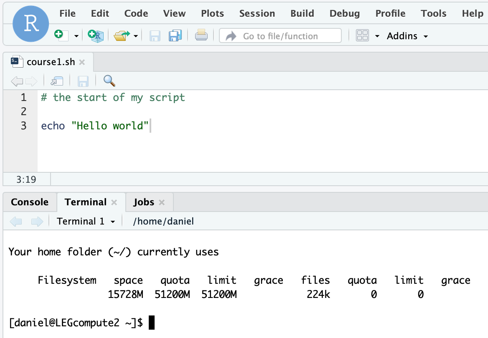

### Bioinformatics Tools


# Course 1: Introduction to the command line or a "shell"


### Major aims  

- Have a basic understanding how to interact with a command line interface
- Know how to use common utilities to download, create, navigate, search and edit folders and files

## Using RStudio Server to access the server "shell"  

- Connect to RStudio Server following the instructions on the general course page (one level up).
- Locate at the bottom left the tab "Terminal". If you've accidentally closed it, you can re-open one by going in the menu bar to "Tools" -> "Terminal" -> "New Terminal"
- The content of the tab contains the "welcome" message by our lab's server. This can be very different between servers/computers.
- You are now using a bash shell (Bourne Again SHell). If you want to know details, check out the [Wiki](https://en.wikipedia.org/wiki/Bash_(Unix_shell)) page. `bash` is a very simple programming language. Other types of shell languages include `zsh`.

## What is a shell good for?  

- Put simply, a shell helps you to interact with a computer/server without a graphical interface (where you could click on icons, move things around, etc.)
- A shell requires you to type commands. If you are familiar with R, you know exactly how this can look like. Our shell here simply uses a different language to interact with the computer compared to R.
- A shell helps you also navigate files and folders. We'll need to tell the shell though to move "up" or "down" the hierarchy of folders to get around.
- Finally, for bioinformatics a shell helps you to repeat analyses, run these in loops, download and copy large files automatically, summarize information, etc. In other words, if you have code that works, running analyses becomes nearly effortless. Writing the code in the first place is often a different matter! :-)

## First steps in a shell

- Create a shell script file to record what you will do. RStudio => File => New File => Shell Script. Save it. Keep a good record of all your commands, so that you can refer yourself to this later.
- You see that the script file gets some automatic coloring (e.g. # comment lines)

  

- Use now always the "Terminal" at the bottom. Not the "Console", this is for R only!

Type the command shown above and press Enter. You see that the code above is actually composed of a little "program" called `echo` and some text to use ("Hello world"). `echo` simply writes you this text out. Try it with some other text.

### Tips to save you time
- You can choose to write all code in the script file and execute the commands below by selecting a particular line (or multiple lines) of script code. Then copy-paste below. Press Enter.
- Even better, you can select the line(s) and press CMD and ENTER (on a Mac keyboard) or CTRL and ENTER (on a Windows keyboard). This will immediately run the code in the Terminal without copy-pasting.
- If you decide to write code directly in the Terminal, use the auto-complete function. So, to use the `echo` command, start by typing `ec` and then press the TAB key twice quickly. You see that there are `echo ecitmatch econtact` as commands starting with `ec`. Type now `h` to have the word `ech` in the Terminal. Press the TAB key twice again and you will see that the `ech` was completed to `echo`. You can use this for any command. Once a command is complete in the Terminal, press ENTER.
- The auto-complete function using the TAB key also works to specify an existing file or folder. This is not only useful to save time but also avoids typos.
- Check out the troubleshooting tips at the bottom if you get stuck. Don't hesitate to ask for help.

## Simple programs to use in a shell

- You are now connected to a computer running a specific operating system called [CentOS](https://en.wikipedia.org/wiki/CentOS). This is a variant of Linux just as Ubuntu, Fedora, etc. Most commands you'd find for any Linux operating system should work here too. Hence, it should be easy to google things!

We will now explore a series of simple commands.

### The `pwd` command

"Present working directory" - This tells you the place (or more precisely the "path") where you are currently. `/home/daniel` means that I am in a folder called `home` placed at the top of the folder hierarchy on the computer. This is the `/`. Inside `home`, there is a folder with my name `daniel`.

This command is very useful to see where you are in case you get lost.

Try it out by simply typing `pwd` and ENTER.

### The `mkdir` command

"Make directory" - This does exactly this. Use this to create a directory called `my_first_scripts` by issuing the command `mkdir my_first_scripts`.

Tip: Avoid using spaces in names. It is not forbidden but inconvenient. Use `_` instead.

Use Google to find if other mkdir options exist. An example is `mkdir -p`.

### The `cd` command  

"Change directory" - Allows you to change to a different directory (i.e. folder). Start an example like this:  

```
# this checks where you are, you should be here /home/username (e.g. /home/bt-daniel)
pwd

# check that your new folder exists. We'll explain the command below.
ls
# Do you see "my_first_scripts"?

# change to your new directory
cd my_first_scripts

# use pwd to verify your new location
pwd

# to go back one level (go "up" in the hierarchy)
cd ..

# go to your home directory /home/username
cd

# go can also go multiple folders in with a single command
cd /folder1/subfolder/subsubfolder
# the above will not work unless the folders actually exist!
```

### The `ls` command

"List" - This command provides you with a list of files and folders in your current directory. Use the command to see whether your newly created folder exists.

Briefly describe what the following command options are doing. Google the answer if you are unsure.

```
# start with going to your home directory
cd

# the commands to check out
ls -l  
ls -s  
ls -a
ls -h
ls -lsh # this is a combination of options!
ls -R
```

### The `echo` command

As we have seen above, you can simply write some text to be displayed.
`echo "Hello world"`

The output is written by default into the Terminal, but we can modify this using the `>` sign.

This command here will write the same text to a new text file.
`echo "Hello world" > new_file.txt`

Use `ls -lsh` to check whether the new file was created.

PS: the `.txt` extension is not necessary. The computer creates a text file regardless. Extensions are used by Windows or macOS to launch the correct application (e.g. Word for `.docx`).

You can _add_ also text to an existing file using `>>`. So if you have created alreads `new_file.txt`, this will create a second line to this file.
`echo "Hello again!" >> new_file.txt`

Repeat the command to add even more lines.

### The `cat` command

How to know what the text file `new_file.txt` actually contains? Use `cat`:  

`cat new_file.txt`

Do you see the expected text based on your code for `echo`?

### The `head` and `tail` commands

These commands work like `cat` but show you only the first (`head`) or the last (`tail`) lines of the file.

`head new_file.txt`

By default, the commands show the first or last 10 lines (if that many exist). You can change this behavior like this:

To show only the very first line:  
`head -n 1 new_file.txt`

To show only the two very last lines:  
`tail -n 2 new_file.txt`

As a little exercise: Use the `echo "Hello again!" >> new_file.txt` command to add at least 11 lines to your `new_file.txt`. Use now the `head` command to create a new file called `only_the_top3.txt` containing the first three lines of `new_file.txt`. Use `cat` to check that it is working as intended.

### The `less` command

The `less` command shows you the beginning of a large file and lets you scroll down using the arrow keys. Type `q` to get out if you are stuck.

### A very simple text editor called `nano`

`nano` is a miniature text editor that is accessible in the Terminal. You can create a new text file called `my_code.sh` like this:

`nano my_code.sh`

You have now entered the text editor. Type any text you like. Press Enter for a new line. The cursor helps you to move around. To save your file use the key combination CTRL and the letter "x". It will ask you to save the file yes/no. So, answer with "y" if you want to save it. It will then show you a line where you can accept the file name or provide a new one. Exit with ENTER.

Try out some of the other options offered by `nano`. Exercise `nano` a bit so that it feels more intuitive. We will use this a few more times.


### Downloading a file from the internet with `wget`

The first step is find the correct link to a file. The link should typically end in a recognizable format (.txt, .html, .jpeg, .pdf, etc.).

Here's the link to an image from the UNINE MSc Biology page:

`https://www.unine.ch/files/live/sites/systemsite/files/bandeaux/FS/UNINE_FS_MA.jpg`

You can paste the link in a web browser to check that it works.

To download the image, use `wget` before the link.

`wget https://www.unine.ch/files/live/sites/systemsite/files/bandeaux/FS/UNINE_FS_MA.jpg`

Check with `ls -lhs` whether you've actually saved the file.

You see that this uses a command called `wget` stands for "World Wide Web and get". So, that seems to fit.

In the folder `datasets` of Course 1, you find a file called `QTW58944_protein.fasta`. You can try to download this "manually" by clicking on the file on the Github website.

But with our `wget` command it's much simpler actually:

`wget https://raw.githubusercontent.com/crolllab/teaching/master/Bioinformatics_Tools/Course_1_Intro_CL/datasets/QTW58944_protein.fasta`

As a little exercise, find another file on the internet and try to download it with `wget`.

### Copying and moving with `cp` and `mv`

The `cp` copy command works simply as a "what" to "where" command.

Using the file we've downloaded above, create a new copy:

`cp QTW58944_protein.fasta QTW58944_protein.second_copy.fasta`

Check with `ls -lhs` whether it worked as expected.

Let's create now a new folder called `new_folder` like this:

`mkdir new_folder`

Now, let's move the newly copied file into this folder:

`mv QTW58944_protein.second_copy.fasta new_folder`

Check with `ls -lhs` whether it worked as expected. Did the file "disappear" into the new folder?

Check the content of the folder:

`ls -lhs new_folder`

Do you see the moved file?

If you need to copy an entire folder (not just a file), use the option `-r`. As an example, let's create first a second folder.

`mkdir second_folder`

Now let's copy the entire `new_folder` into the `second_folder`

`cp -r new_folder second_folder`

Check the contents of the various folders (inside folders):

```
ls -lhs
ls -lhs second_folder
ls -lhs second_folder/new_folder
```

Did everything work as expected?

## Synthesis exercise of the first course

Try to accomplish the following tasks
- Download the `QTW58944_protein.fasta` file as above
- Use `nano` to edit the first line of the file. Call it simply "delta variant". Make sure to keep the `>` at the beginning of the first line.
- Rename the entire file using `mv` to `Delta_variant_proteins.fasta`
- Use `cat` to see the entire file content. Copy the entire content by selecting the text and then use COMMAND + "c" (Mac) or CTRL + "c" (Windows).
- Go to the [NCBI Blast website](https://blast.ncbi.nlm.nih.gov/Blast.cgi) and click on "Protein BLAST".
- Paste the entire text into the "Enter Query Sequence" field.
- Scroll down and push on the "BLAST" button. It will take now a couple of minutes for something to happen. The page should refresh automatically though.
- What do you think have you done? What do we see? (Remember also to click on the "Results for" option to select a different sequence).


### General troubleshooting tips
- We will look at a command called `cp`. Googling for "Linux cp" tells you fairly well what to do.
- Read the (error) message that you get in the Terminal following your commands. You may not understand these, but it's a good sign that you should expect something strange (a missing file, etc.).
- Google the error message. Copy the error message and search for it. Helpful? Try to improve your code googling skills during the course.
- If you can't find a file that you have downloaded or created, start by checking with `pwd` where you are. Then check whether you might have saved the file in a different folder? Was there any error message about a location or file not found?
