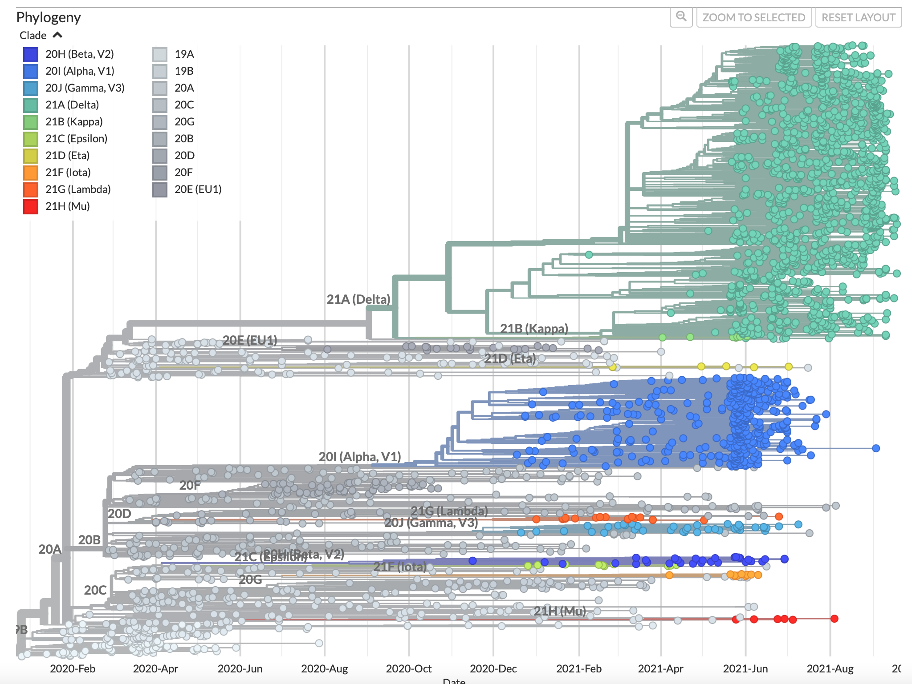
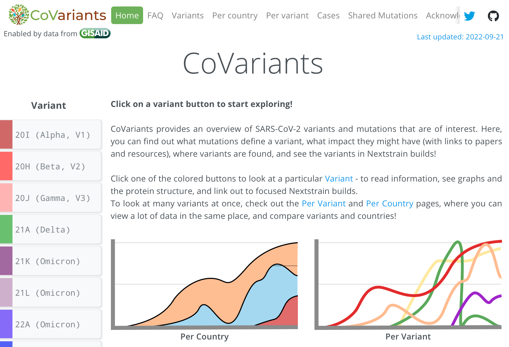
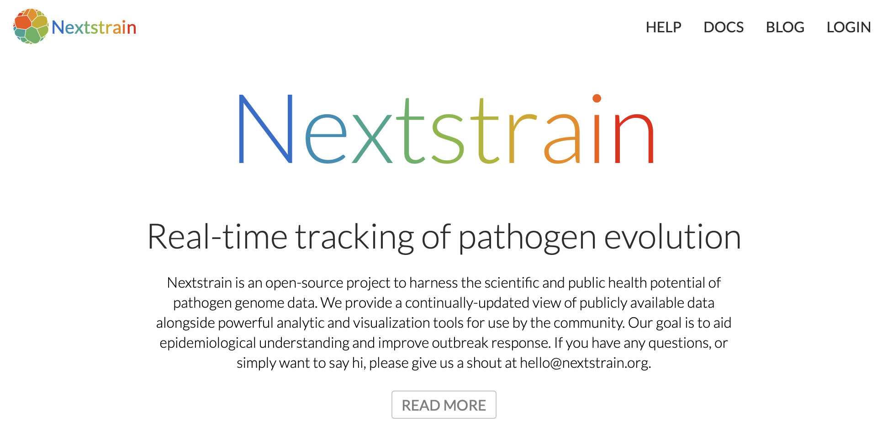
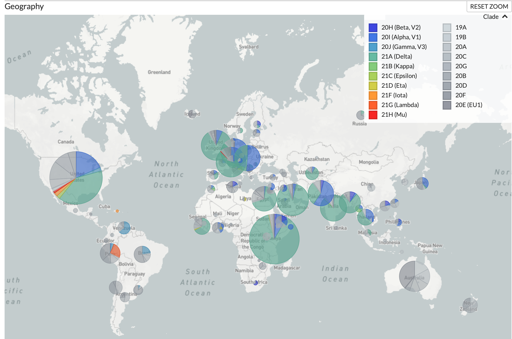
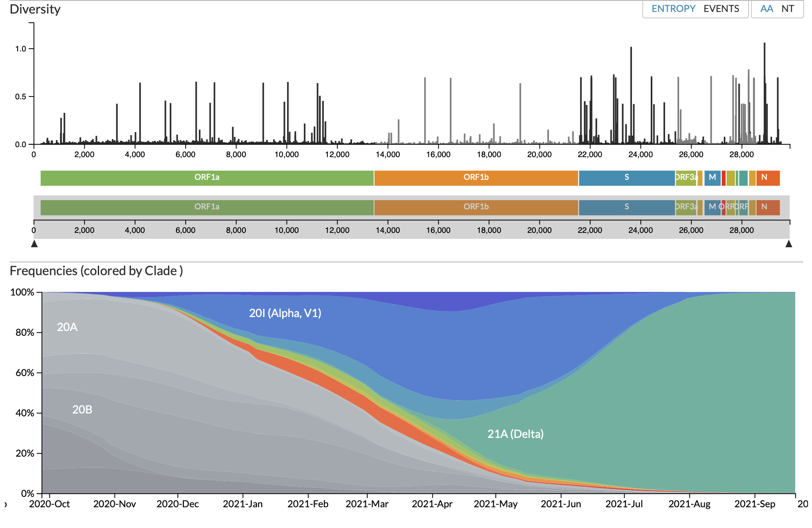

### Bioinformatics Tools

# Course 2

### Major aims  
- Know how to install bioinformatics software using conda
- Access the NCBI sequence database to retrieve data
- Build a phylogenetic tree and visualize it

  

### Report to submit

Please compile brief answers to the questions for your report ("Q1", "Q2", etc.). Depending on the question, you can add a short text, some code or a graphic. The answers can be in a text file, Word doc, etc.

You can work alone or in groups. Every student should submit their own report through Moodle though. No copy-pasting, please. Formulate answers in your own words.


## How to install software (the easy & hard way)

The first step in a bioinformatics project often includes installing software. Here's a quick overview how software or programs are added in a command line environment.

### Where are last week's programs located?

The command `which` tells you the location of a program.

`which pwd`  
`which ls`  
`which cd`  

What do you notice? You see that all these basic programs from last week's course are located here `/usr/bin`. This is a shared space among all users and is typically a protected space so that not any user could add or remove a program from there.

You find that the folder is called `bin`. This stands for binaries, which is a technical term for a program or code that can be executed. Our compute cluster has multiple `bin` folders for different purposes. Check these out by typing:

`echo $PATH`

The command above displays what is contained in `$PATH`. The `$` indicates that the following word (or _string_ in technical terms) is a variable. In R, `PATH` alone could be used as a variable. Unlike in R, a bash variable needs to identified by the `$` sign.

The output shows a large number of folder locations or "paths". Each location is separated by a `:`.

_Q1: Copy the output of `echo $PATH` and say how many different bin folders are listed in `$PATH`?_

## How to install new programs - two recipies

### 1.) Add a program to a `bin` folder (the "hard way")

The most basic approach is to find a compatible program (or binary) online and place it in any of the above discovered `bin` folders. You typically do not have the permission though to place a program in e.g. `/usr/bin`, but you could create your own `bin` directory in your home folder like this:

```
# this changes your location to your home directory (if necessary)
cd $HOME

# create your own bin directory
mkdir bin
```

Now we need to tell the computer that you have a new `bin` directory. This works like this:

`export PATH=$PATH:$HOME/bin`

`export` is a command that defines a variable. Here it is `PATH`, the variable containing all `bin` folders.

Note that using a variable `VAR` in bash is a bit unintuitive:
- To define a variable use: `export VAR=1234`
- To ask for the content use: `echo $VAR`

You see that we need the `$` sign only when recalling a variable, but not when defining it.

`$PATH:$HOME/bin` creates a combination of the existing content of `$PATH` (remember that we need `$` to ask something from a variable) and your new `bin` folder located in your home directory. The `:` marks the separation between the two elements.

You can check the full content: `echo $PATH:$HOME/bin`

The challenge with downloading programs directly as bins is that often the correct version is unavailable and would need to be created first from the source code. This process is called "compilation".

Here's a walk-through to install a very popular bioinformatics tool used to align short sequence reads to an entire genome.

The software is called [bowtie2](http://bowtie-bio.sourceforge.net/bowtie2/index.shtml)

```
# The website provides this link for the source code
https://sourceforge.net/projects/bowtie-bio/files/bowtie2/2.4.4/bowtie2-2.4.4-source.zip

# Download the file
wget https://sourceforge.net/projects/bowtie-bio/files/bowtie2/2.4.4/bowtie2-2.4.4-source.zip

# This is a compressed file, so use unzip
unzip bowtie2-2.4.4-source.zip

# Use ls to see what you have now
ls -lhs

# Let's enter the new folder called bowtie2-2.4.4
cd bowtie2-2.4.4

# There are many files containing the actual code of the program
ls -lhs

# An example of the main component of the program
head -n 50 bowtie_main.cpp

# Let's compile the software to create the binaries (takes 2-3')
make
```

_Q2: List the newly created files by the `make` command._

```
# copy the newly created files to your own bin directory
cp bowtie2* $HOME/bin

# check the content. All ok?
ls -lhs $HOME/bin
```

Start using bowtie2
```
# make sure the computer knows about your own bin folder
export PATH=$PATH:$HOME/bin

# now run bowtie2
bowtie2
```

You should see a long list of options how to perform an analysis with `bowtie2`.

_Q3: What is the output of `which bowtie2`? What does this mean?_

We will not go any further with this approach here. Just remember that this exists as an option.


### 2.) Use a helper program to install other programs (the "easy way")

  

Here we will make use of a program called `conda`. `conda` works a bit like a book library where (if the book exists) you can very easily get access to. An alternative to `conda` is called `brew`.

To get started, we need to set up correctly `conda`.

- Make sure you start in your user folder: `cd $HOME`
- Use `conda create -p $HOME/conda-env` to initialize conda in your user account. You see that we define a new directory inside your home folder for this. You only need to do this step once!
- To start using conda type `conda activate $HOME/conda-env`. This will "activate" conda for you. This step needs to be repeated whenever you log in (i.e. start using RStudio again or re-open the "Terminal").

Let's install our first program: To obtain our proper version of BLAST (see the end of Course 1 for the online version), use this `conda` command:

`conda install -c bioconda blast`

After a short moment, you will be presented with a lot of lines of text. This is the "recipe" that conda will use to install blast. You see that it's a fairly complex process given all the different ingredients (or dependencies) that are required. Luckily, conda will take care of this.

Simply type `y` and ENTER to confirm. ENTER alone works as well.

Check that we actually have now BLAST installed by typing:

`blastp` (this is the protein BLAST).

You see that the output starts with `BLAST query/options error: ...`. So, we have obviously not yet properly started the program or defined the correct files. But we are sure that blast is installed. If the program were _not_ installed, we'd see `command not found` as an error message!

_Q4: Where is `blastp` located?_


## Searching and retrieving sequences from the NCBI database

Last week, you have downloaded a single file containing a few sequences of a single SARS-CoV-2 genome. The tutorial below shows you how to do this directly from the NCBI website instead of our Github site.

### Installing a helper program for NCBI

We will use the tool [Entrez Direct](https://www.ncbi.nlm.nih.gov/books/NBK179288/) for this.

Start by installing it using `conda`. Don't forget to activate `conda` if necessary (see above). The code below installs Entrez Direct but also some additional tools that are required.

`conda install -c bioconda perl-io-socket-ssl perl-net-ssleay perl-lwp-protocol-https entrez-direct`

You can check that you have installed it properly by typing:

`esearch` and the answer should be `ERROR: Missing -db argument`.

(If you have not installed the program correctly, the error should read `command not found`)

  


### Retrieving a sequence with a known accession number

Last week, we have analyzed the spike (or surface) protein of SARS-CoV-2. Looking at the file, you will see that the accession number for this specific sequence was `QTW58946.1`. Let's see whether we can search this accession on NCBI:

`esearch -db protein -query QTW58946.1`

We have specified to search in the protein database using the `-db` option.

PS: If for some reason the `esearch` command sends you error messages and won't stop, use the CTRL + "C" key combination.

The standard output of `esearch` is in a format called xml and rather difficult to read at first glance. But you see the `<Count>...</Count>` line that shows how many matches there were in the database.

_Q5: How many times did `esearch` find the accession number?_

We can now combine the `esearch` command with a second tool by Entrez Direct called `efetch`. The idea is to provide the search results of `esearch` to `efetch` so that the latter program can download the actual sequence. This works like this:

`esearch -db protein -query QTW58946.1 | efetch -format fasta`

Note: The `|` has a similar meaning as the `>` from last week. This is called a _pipe_ and connects the output of a first program to what a second program can understand.

In our case, `esearch` will provide the xml file for `efetch` to retrieve the correct sequence.

You see that the sequence matches exactly the one in the file from last week. There is only one sequence instead of 12, as we have only asked for the spike protein sequence.

We can further extend the code above to not only display the sequence in the Terminal but write it to a file. Here, we need the familiar `>` sign.

`esearch -db protein -query QTW58946.1 | efetch -format fasta > QTW58946.1_protein.fasta`

Use `ls` and `cat` to verify that all worked as expected (checking the files produced and their content)


## Search the NCBI database for many SARS-Cov-2 genome sequences.

Let's make sure you work in your
 home directory, so type:
`cd`

(you can obviously also choose to work in a different folder, but be aware that 1-2 lines of code below may need tweaking)

We start with making sure conda is active.
`conda activate $HOME/conda-env`

Now we want to search not for a single sequence (or accession) but for all sequences of the SARS-CoV-2 virus.

We will use the following search term. Note also that we will now look for the nucleotide (or genome) sequence, not the protein sequence.

`esearch -db nucleotide -query "Severe acute respiratory syndrome coronavirus 2 isolate SARS-CoV-2"`

_Q6: How many such sequences exist on NCBI?_

We now proceed to downloading these sequences. There are far too many, so we need to limit ourselves. Let's analyze 500 random sequences using the `-stop` option like this. [If you are brave, you can try more than 500]

`esearch -db nucleotide -query "Severe acute respiratory syndrome coronavirus 2 isolate SARS-CoV-2" | efetch -format fasta -stop 500 > SARS-CoV2.genome.nucl.fasta`

_Q7: Use `head` to check the accession number of the very first sequence in the newly created file. Is it actually a SARS sequence?_

We will now add one more very specific genome sequence from a virus sampled almost at near the origin of the pandemic. This will help us define the root of the phylogenetic tree later.

Check the accession here on [NCBI](https://www.ncbi.nlm.nih.gov/nuccore/LR757998.1?report=genbank).

_Q8: Where and when was the virus sample collected?_

Let's retrieve also this specific genome.  
`esearch -db nucleotide -query "LR757998.1" | efetch -format fasta > LR757998.fasta`  

Let's append the sequence to our existing file with the 500 sequences using the `>>` sign (see Course 1 for `>>`).  
`cat LR757998.fasta >> SARS-CoV2.genome.nucl.fasta`

We will now repeat it for our Delta variant genome of last week.  
`esearch -db nucleotide -query "MW931310.1" | efetch -format fasta > MW931310.fasta`  
`cat MW931310.fasta >> SARS-CoV2.genome.nucl.fasta`

And an Alpha variant from the UK.  
`esearch -db nucleotide -query "OU297363.1" | efetch -format fasta > OU297363.fasta`  
`cat OU297363.fasta >> SARS-CoV2.genome.nucl.fasta`  

A Gamma variant from South America.  
`esearch -db nucleotide -query "OK252993.1" | efetch -format fasta > OK252993.fasta`  
`cat OK252993.fasta >> SARS-CoV2.genome.nucl.fasta`  

A Mu variant from North America.  
`esearch -db nucleotide -query "MZ727692.1" | efetch -format fasta > MZ727692.fasta`  
`cat MZ727692.fasta >> SARS-CoV2.genome.nucl.fasta`  

And Omicron variants BA.1, 2, 4, 5 and 2.75 (the latest in Sep 2022)  
`esearch -db nucleotide -query "OX315743.1" | efetch -format fasta > OX315743.fasta`  
`cat OX315743.fasta >> SARS-CoV2.genome.nucl.fasta`  

`esearch -db nucleotide -query "OX315675.1" | efetch -format fasta > OX315675.fasta`  
`cat OX315675.fasta >> SARS-CoV2.genome.nucl.fasta`  

`esearch -db nucleotide -query "OP093374.1" | efetch -format fasta > OP093374.fasta`  
`cat OP093374.fasta >> SARS-CoV2.genome.nucl.fasta`  

`esearch -db nucleotide -query "OP164778.1" | efetch -format fasta > OP164778.fasta`  
`cat OP164778.fasta >> SARS-CoV2.genome.nucl.fasta`  

`esearch -db nucleotide -query "OP457109.1" | efetch -format fasta > OP457109.fasta`  
`cat OP457109.fasta >> SARS-CoV2.genome.nucl.fasta`  


Our `SARS-CoV2.genome.nucl.fasta` should now contain the 500 sequences retrieved initially and the 10 variant sequences.


## Generate a multiple sequence alignment and phylogenetic tree

Our downloaded sequences are not perfectly matched up against each other. In other words, our sequences right now look like this:

```
>seq1
GGTACCAATTAA
>seq2
ATGGTACCAATTAA
>seq3
TATGGTACCATTTAA
```

Rather than this:

```
>seq1
---GGTACCAATTAA
>seq2
-ATGGTACCAATTAA
>seq3
TATGGTACCATTTAA
```

Only an aligned set of sequences can be used for building a phylogenetic tree.

Let's install all needed tools for the remainder of the exercise.

`conda install -c bioconda mafft clipkit raxml`

We will use the program [mafft](https://mafft.cbrc.jp/alignment/software/) to generate an aligned set of sequences.

`mafft --auto --thread 10 SARS-CoV2.genome.nucl.fasta > SARS-CoV2.genome.nucl.mafft.fasta`

The code above allows `mafft` to use 10 CPU to make the analyses faster. It will still take between 3-15'. Plan in a break or some other work.

The resulting file contains our aligned sequences.

To be extra cautious with our alignment, we will now use a quality-check program called [ClipKIT](https://jlsteenwyk.com/ClipKIT/index.html) to evaluate our aligned sequences.

`clipkit SARS-CoV2.genome.nucl.mafft.fasta -m smart-gap`

We asked for any site with too many gaps (see `-` above) to be removed.

The output file is called `SARS-CoV2.genome.nucl.mafft.fasta.clipkit`

We proceed now to build a phylogenetic tree using [RAxML](https://cme.h-its.org/exelixis/web/software/raxml/).

`raxmlHPC-PTHREADS --no-seq-check -s SARS-CoV2.genome.nucl.mafft.fasta.clipkit -m GTRCAT -p 1234719872 -n SARS-CoV2.genome -T 10`

The code above allows `RAxML` to use 10 CPU to make the analyses faster. But it will still take a couple of minutes.

_Q9: How many output files did RAxML produce?_

Our most important file is `RAxML_bestTree.SARS-CoV2.genome` containing the phylogenetic tree.

Have a look at this file using `head`. You see now how a tree is encoded in a simple text format using parentheses.

Note: If you decide to re-run RAxML, you must delete the output files first. As ours start with `RAxML...`, we can use `rm RAxML_*`

## Use the R package `ggtree` to visualize our SARS-Cov2 tree

We need to now switch tabs from "Terminal" to "Console". With this we stay though on the server and can access all files.

Here follows the R code to visualize the tree.

```
### R code

# make sure that you are in the same folder of your RAxML output
# use setwd("/home/bt-.....") if necessary.

# load the libraries
library("ape")
library("Biostrings")
library("ggplot2")
library("ggtree")
library(treeio)

# load the tree file
tree <- read.tree("RAxML_bestTree.SARS-CoV2.genome")

# define the root with the very early viral genome sequence
tree.rooted <- root(tree, outgroup = "LR757998.1")

# modify tree tip labels to show only variant names
tree.df <- data.frame(label = tree.rooted$tip.label)

# start with an empty new label
tree.df$new_label <- ""

# for each specific variant sequence, set a label
tree.df[grepl("LR757998", tree.df$label),"new_label"] <- "Wuhan, China"
tree.df[grepl("MW931310", tree.df$label),"new_label"] <- "Delta variant"
tree.df[grepl("OU297363", tree.df$label),"new_label"] <- "Alpha variant"
tree.df[grepl("OK252993", tree.df$label),"new_label"] <- "Gamma variant"
tree.df[grepl("MZ727692", tree.df$label),"new_label"] <- "Mu variant"
tree.df[grepl("OX315743", tree.df$label),"new_label"] <- "Omicron BA.1 variant"
tree.df[grepl("OX315675", tree.df$label),"new_label"] <- "Omicron BA.2 variant"
tree.df[grepl("OP093374", tree.df$label),"new_label"] <- "Omicron BA.4 variant"
tree.df[grepl("OP164778", tree.df$label),"new_label"] <- "Omicron BA.5 variant"
tree.df[grepl("OP457109", tree.df$label),"new_label"] <- "Omicron BA.2.75 variant"

# replace the labels in the tree
final.tree <- rename_taxa(tree.rooted, tree.df, label, new_label)

# visualize the tree
ggtree(final.tree) +
  geom_treescale() +
  geom_tiplab(aes(color = label), size = 5) +
  geom_tippoint(size=2, fill="white", color="black")

# save it to PDF (it will be a very tall figure)
ggsave("SARS-CoV2_genomes_tree.pdf", height = 40, width = 12)

```

_Q10: Paste the tree in your report and briefly describe what you see. To what variant belong most of your sequences most likely?_

_Q11: [covariants.org](https://covariants.org) provides a great way to track waves of different SARS-CoV2 variants. What is the currently prevalent variant in Switzerland?_

  

To explore much more data, you can head to the excellent [Nextstrain website](https://nextstrain.org/ncov/open/global).

  

  

  
