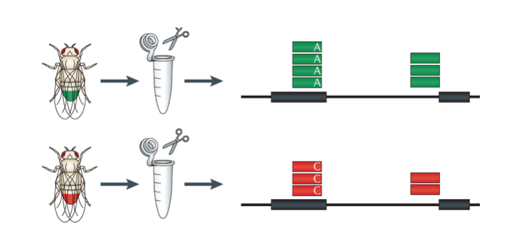
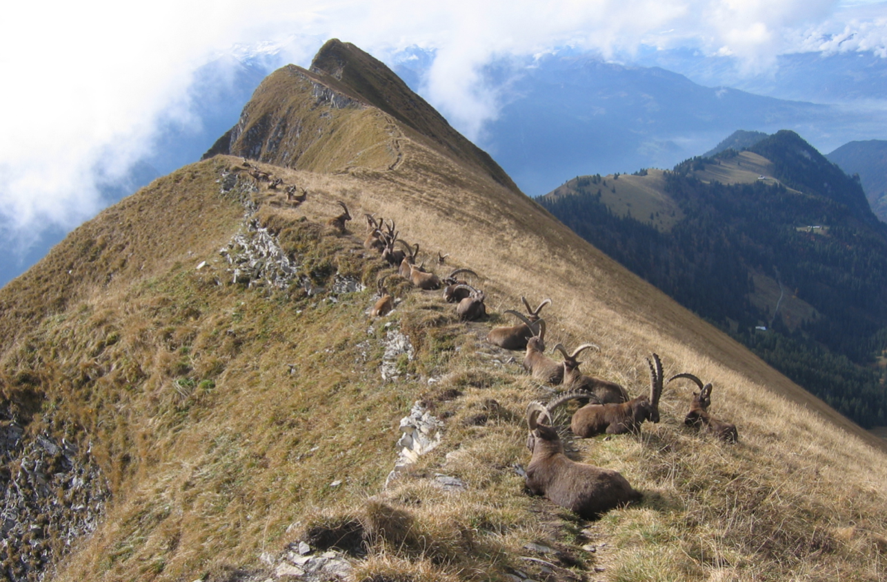
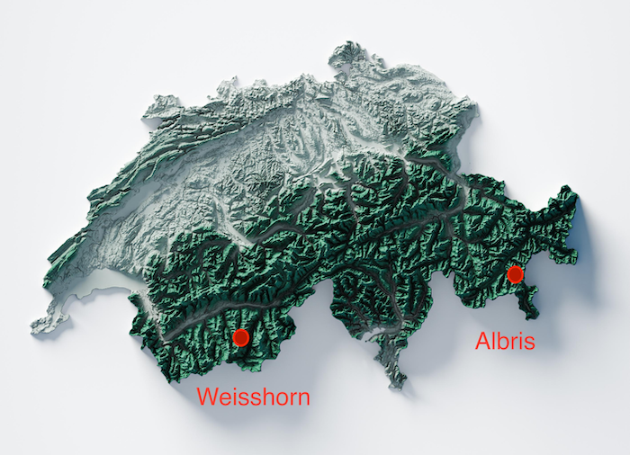
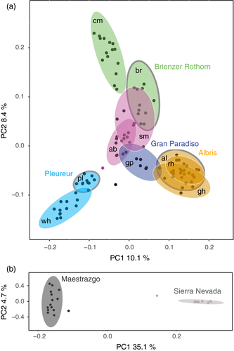
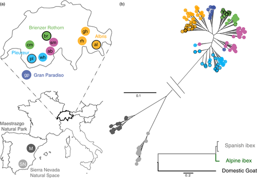

### Bioinformatics Tools

# Course 3

### Major aims  
- Apply the tools/command line knowledge from Course 1+2
- Know about using a basic loop
- Use read mapping and SNP identification to analyze the genetic structure of Alpine ibex

### Report to submit

Please compile brief answers to the questions for your report ("Q1", "Q2", etc.). Depending on the question, you can add a short text, some code or a graphic. The answers can be in a text file, Word doc, etc.

You can work alone or in groups. Every student should submit their own report through Moodle though. No copy-pasting, please. Formulate answers in your own words.

## Reminder: How to activate and use conda

Conda helps you install bioinformatics software easily.

1.) At first use, run `conda create -p $HOME/conda-env` to create an environment for conda to run in the folder `conda-env`. The folder name can be chosen freely.

2.) Every time you open a new terminal window: `conda activate $HOME/conda-env`

3.) Install software like this `conda install -c bioconda vcftools` (`-c bioconda` helps conda to search in the right place but is not strictly necessary)


## Accessing Illumina (short read) sequencing data

The [NCBI Sequence Read Archive](https://www.ncbi.nlm.nih.gov/sra) (SRA) is the main repository for whole genome, transcriptome and other large sequencing datasets. The data is stored in way that nearly all information obtained from the sequencing machine is preserved.

Here's an example of an Alpine ibex dataset with the accession number [SRX3563628](https://www.ncbi.nlm.nih.gov/sra/SRX3563628)

_Q1: How many bases were sequenced? What is the "Strategy"?_

The strategy describes how sequences were obtained from the genome.

_Q2: Use Google to search what the abbreviation means. Describe in a couple of sentences the principle._

  

There are two ways to download such a dataset:

1.) You can find the link to the sequence files. Start by clicking on the [SRR6473757](https://trace.ncbi.nlm.nih.gov/Traces/sra/?run=SRR6473757) link at the bottom of the page. The tab "Data access" provides you with links. You could e.g. use `wget ...` to download one set.

2.) The much more convenient way is to use the `sra-tools` (see below).

## Analyzing Alpine ibex populations

  

### Install all necessary tools with conda

The first line below brings you to your home folder. You can choose a different folder, but be aware that you may need to search files in a different location later.

```
cd
conda activate $HOME/conda-env
conda install -c bioconda sra-tools=2.10 bowtie2 freebayes vcftools
```

### Download datasets from the NCBI SRA

We analyze 9 Alpine ibex individuals with each having a single dataset available on the NCBI SRA.

To download the first dataset, we can use the the `sra-tools` command `fastq-dump`:

`fastq-dump --split-files --gzip SRR6649845`

_Q3: What is the name of the ibex individual? Use the [NCBI SRA website](https://www.ncbi.nlm.nih.gov/sra) to search for the accession number. Hint: the individual name is under "Library" -> "Name"_

For our little project, we want to analyze the following individuals:

```
SRA_ID population  individual
SRR6649844	Albris	GR0201
SRR6649845	Albris	GR0379
SRR6649843	Weisshorn	VS0492
SRR6649846	Weisshorn	VS0081
SRR6649847	Weisshorn	VS0515
SRR6649848	Weisshorn	VS0079
SRR6649849	Weisshorn	VS0491
SRR6649850	Weisshorn	VS0034
SRR6649851	Weisshorn	VS0037
```

  

To avoid creating 9 commands to download each file, we can use a loop.

Here's a loop example that prints out a series of numbers:
```
for i in 1 2 3 4 5
do
echo $i
done
```

In the above example, you see the "ingredients" of a loop. `for` defines what should be repeated. We will use the variable `i` to take the values from 1 to 5.

Between `do` and `done` are all the commands that should be included in the loop. The example will simply print out the content of the variable `i` (now written as `$i`).

There are many more useful kinds of loops with either `for` or `while`.

### Download all Alpine ibex dataset in a loop

We specify all accession numbers to be downloaded in the loop. The code below will run for a few minutes.

```
for i in SRR6649845 SRR6649843 SRR6649850 SRR6649844 SRR6649848 SRR6649849 SRR6649851 SRR6649847 SRR6649846
do
fastq-dump --split-files --gzip -N 10000 -X 310000 $i
done
```

`fastq-dump` is our command to access and download the sequencing data. `split-files` means to create two files corresponding to the paired reads of the sequencing run.

_Q4: What is paired-end versus single-end sequencing?_

`gzip` means to compress the output. `-N` and `-X` options are helping us in the course to download only a snapshot of the actual dataset to speed up analyses. For a research project, we would always access the entire dataset.

_Q5: How many files did you produce with the loop above?_

### The sequence format fastq

In the last weeks, we have seen already the format `fasta`.

```
>sequence_name, more info, ...
ATGTTAGCTTATCTATCTCTACTACTCTTTAT
GTATTCTATCTTATGTATATCTATCTTCTAT
```

Here's a glimpse at the `fastq` files:
`zcat SRR6649845_1.fastq.gz|head`

_Q6: Explain the basic features of this format (using Google)_

### Aligning sequencing reads to a genome

Alpine ibex do not have a very well assembled genome yet. This is why we typically use the genome of the closely related domestic goat. Here you find the full information about this genome on [Ensembl Genome](https://www.ensembl.org/Capra_hircus/Info/Annotation).

To save time, the genome exists already on our server. The location is here:
`/home/genomes/fasta/Capra_hircus.ARS1.dna.toplevel`

_Q7: Use `head` to read the name of the very first sequence._

We will now use a loop to align each set of sequences to the domestic goat genome. The tool is called `bowtie2` (see also Course 2).

The code below will run for a few minutes.

```
# we define a variable to shorten the long path
REFGENOME=/home/genomes/fasta/Capra_hircus.ARS1.dna.toplevel

# start of the loop (as above)
for i in SRR6649845 SRR6649843 SRR6649850 SRR6649844 SRR6649848 SRR6649849 SRR6649851 SRR6649847 SRR6649846
do
# bowtie2 with all the required options
bowtie2 -x $REFGENOME -p 16 --rg-id $i --rg SM:$i -1 ${i}_1.fastq.gz -2 ${i}_2.fastq.gz | samtools view -bS - | samtools sort -o $i.sorted.bam
# create an index of the bam file
samtools index $i.sorted.bam
done
```

The bowtie option `-x` defines the reference genome. `-p` defines how many processors should be used. `rg` and `rg-id` are "labels" that will help us later identify again the individual. `-1` and `-2` define the downloaded sequences. You see that we use the `$i` variable to create the correct filename.

`|` is the pipe command to pass the output to the next tool called `samtools`. This tool handles aligned sequences. We first convert the aligned reads to a `bam` format, which is compressed. We then proceed to `sort` the reads according to their location in the genome (e.g. chromosome 1 first, then 2, etc.).

There is a final command to create an index of the aligned reads. This works like a table of contents of a book.

Our final file is called e.g. `SRR6649848.sorted.bam`. You can view the first line like this:

`samtools view SRR6649848.sorted.bam|head -n 1`

_Q8: Use Google to have a look what the SAM alignment format contains. Mention three elements (or columns)._

### Calling SNPs based on the aligned reads

Freebayes is a single step SNP caller to identify polymorphic sites. The code below will run for a few minutes.

```
REFGENOME=/home/genomes/fasta/Capra_hircus.ARS1.dna.toplevel

freebayes -f $REFGENOME.fa -r 1 *.bam -v Alpine_ibex.vcf
```

The `-r` option defines that we will only analyze chromosome 1 (to save time).

The `Alpine_ibex.vcf` is a "variant call format", which is a standard way to report SNPs (and indels) in a genome.

You can explore the beginning and end of the file using `head` and `tail`, respectively.

_Q9: Describe the basic features of a line reporting a SNP (what you see with `tail -n 1 Alpine_ibex.vcf`). Use Google for help._

### Apply basic filtering steps to the SNPs

VCFtools is a very common tool to filter our low quality SNPs or make selections of specific sets of SNPs.

```
vcftools --vcf Alpine_ibex.vcf --max-missing 0.8 --minQ 100 --mac 1 --recode --out Alpine_ibex.filtered
```

With the above code, we defined that a SNP should be genotyped in at least 80% of the individuals, that the minimum quality should be of 100 and that we want at least two alleles present among the analyzed Alpine ibex (`--mac 1`). The `mac` is the minor allele count, so the number of times, we have found the more rare allele. Our filter requires at least 1.

_Q10: How many SNPs (or sites) did vcftools retain after filtering?_

## R code to visualize SNP data

We will switch now to R ("Console", not "Terminal"). Before you start, create a text file containing exactly what is below. Name the file `Alpine_ibex.info.txt`

```
SRA_ID population  individual
SRR6649844	Albris	GR0201
SRR6649845	Albris	GR0379
SRR6649843	Weisshorn	VS0492
SRR6649846	Weisshorn	VS0081
SRR6649847	Weisshorn	VS0515
SRR6649848	Weisshorn	VS0079
SRR6649849	Weisshorn	VS0491
SRR6649850	Weisshorn	VS0034
SRR6649851	Weisshorn	VS0037
```

  

Here we start with R.

```
library(vcfR)
library(adegenet)
library(ggplot2)

# reading in the filtered vcf file
vcf <- read.vcfR("Alpine_ibex.filtered.recode.vcf")
allchr.snps <- vcfR2genlight(vcf)

# reading in the info file
info.df <- read.table("Alpine_ibex.info.txt", header=T, sep="\t")

# check the content
head(info.df)
table(info.df$population)

# assign every individual to its population
pop(allchr.snps) <- info.df$population[match(indNames(allchr.snps), info.df$SRA_ID)]

# create a PCA and the associated data
allchr.pc <- glPca(allchr.snps, nf = 2)
pca.data <- as.data.frame(allchr.pc$scores)
pca.data$pop <- info.df$population[match(row.names(pca.data), info.df$SRA_ID)]

# Visualize the PCA and save the file
ggplot(pca.data, aes(x = PC1, y = PC2, fill=pop, color=pop)) +
  geom_point(size = 3, alpha = 0.5) +
  stat_ellipse(geom = "polygon", alpha=0.2, aes(fill = pop)) +
  ggtitle("Alpine ibex population structure")

ggsave("PCA_Alpine_ibex.pdf", width = 10, height = 8)
```

_Q11: Include the PCA graph and briefly state whether the two populations in the Valais (Weisshorn) and Grisons (Albris) are clearly separated genetically._

---

Further reading about Alpine ibex population genomics:

- Grossen, C, Biebach, I, Angelone-Alasaad, S, Keller, LF, Croll, D. Population genomics analyses of European ibex species show lower diversity and higher inbreeding in reintroduced populations. Evol Appl. 2018; 11: 123– 139. [https://doi.org/10.1111/eva.12490](https://doi.org/10.1111/eva.12490)

  

  
