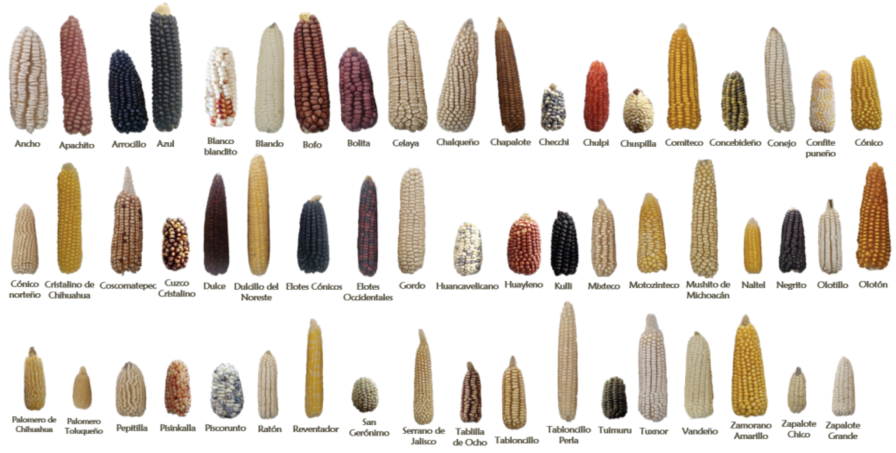
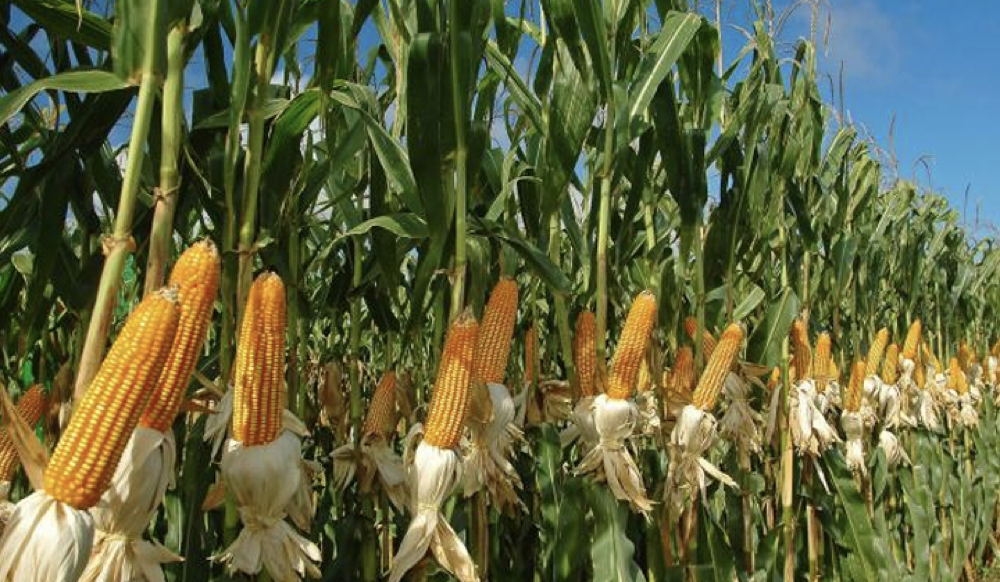
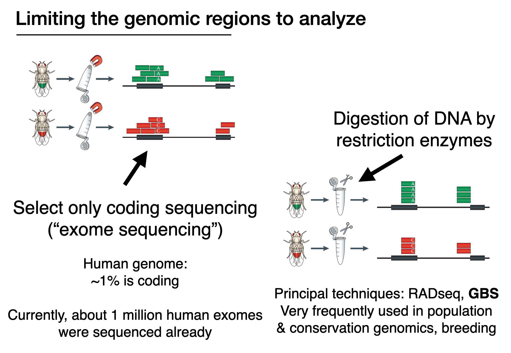

### Bioinformatics Tools

# Course 4

### Major aims  
- A basic understanding of phenotype-genotype association mapping (i.e. GWAS)
- Know key steps of mapping a locus associated with a specific trait

### Report to submit

Please compile brief answers to the questions for your report ("Q1", "Q2", etc.). Depending on the question, you can add a short text, some code or a graphic. The answers can be in a text file, Word doc, etc.

You can work alone or in groups. Every student should submit their own report through Moodle though. No copy-pasting, please. Formulate answers in your own words.

## The maize accession dataset

As a manageable dataset to work with, we will use a diversity study of maize accessions covering the genetic diversity of the crop. At its center of origin in Mexico, farmers retained a very high degree of diversity.

  

59 native Mexican maize landraces, CIMMYT

  

Maize originated from annual teosinte (_Zea mays_ subspecies _parviglumis_) around 9,000 years BP. Co-existing teosinte species in Mexico include also _Zea mays_ subspecies _mexicana_.

  

We will analyze a set of 3093 SNPs (single nucleotide polymorphisms) of 282 inbred maize lines representing the global diversity in maize-breeding programs.

  

## Access the datasets

This genotyping method mainly exists to save money during sequencing. Instead of covering the entire genome, GBS allows to target a small subset of regions. This reduced number of variants (or SNPs) is often sufficient for analyses.

  


Before we download the datasets, let's navigate to a specific folder:

`cd $HOME`

This ensure that we all start the analyses in the same place (our home folder). All data is in the *datasets* folder.

```
### Download links from the github site

# Genotype dataset
wget https://raw.githubusercontent.com/crolllab/teaching/master/Bioinformatics_Tools/Course_4_GWAS/datasets/MaizeDivPanel_282_genotypes_GBS.hmp.txt

# Principal component analysis
wget https://raw.githubusercontent.com/crolllab/teaching/master/Bioinformatics_Tools/Course_4_GWAS/datasets/MaizeDivPanel_282_genotypes_PCs.txt

# Information about the accessions (individuals)
wget https://raw.githubusercontent.com/crolllab/teaching/master/Bioinformatics_Tools/Course_4_GWAS/datasets/MaizeDivPanel_282_genotypes_INFO.txt

# Phenotypic trait dataset
wget https://raw.githubusercontent.com/crolllab/teaching/master/Bioinformatics_Tools/Course_4_GWAS/datasets/MaizeDivPanel_282_phenotypes_33traits.txt
```

_Q1: Use `head` to briefly check out each of the four files. What kind of information is recorded here?_

### Visualize the Genotyping-by-sequencing (GBS) data of maize

From here on, we will work entirely in R ("Console"), not the "Terminal"!

We want to get a good representation of the genetic diversity of our maize individuals (accessions). Here is code to produce a principal component analysis (PCA) of the dataset.

```
# In R "Console"

library(ggplot2)

# read in the data (principal components and info)
PCA.df <- read.table("MaizeDivPanel_282_genotypes_PCs.txt", header=T)
info.df <- read.table("MaizeDivPanel_282_genotypes_INFO.txt", header=T, sep="\t")

# combine the two datasets
joint.df <- merge(PCA.df, info.df, all.x = T)

ggplot(joint.df, aes(x=PC1, y=PC2, color=Subpopulation)) +
  geom_point(size = 3, alpha = 0.5) +
  labs(x = "Principal component 1", y = "Principal component 2") +
  theme(axis.text = element_text(color = "black"))

ggsave("PCA.MaizeAccessions.pdf", width=6, height=4.5)
```

_Q2: What groups (subpopulations) of maize appear most distinct from the others?_

### Visualize the distribution of phenotypic traits

```
# In R "Console"

library(ggplot2)
library(reshape2)

# read in the data (principal components and info)
info.df <- read.table("MaizeDivPanel_282_genotypes_INFO.txt", header=T, sep="\t")
pheno.df <- read.table("MaizeDivPanel_282_phenotypes_33traits.txt", header=T, sep="\t")

# Please check if the code above gives some error message. Anything related to "File not found" or "can't open" usually means one of two things: 1) you have not yet downloaded the files (successfully), or 2) you are running the code in a different folder than the downloaded files.

# rename the first column name (from <Traits> to Accessions)
names(pheno.df)[1] <- "Accession"


# combine the two datasets
joint.df <- merge(pheno.df, info.df)

# melt the data
joint.m.df <- melt(joint.df, value.vars = names(joint.df)[2:34], value.name = "Trait_value", variable.name = "Trait")

# plot histograms for each trait
ggplot(joint.m.df, aes(x = Trait_value)) +

  geom_histogram(bins = 10) +
  facet_wrap(~Trait, scales = "free")

ggsave("Traits.MaizeAccessions.pdf", width=12, height=8)
```

_Q3 (optional): What kind of distribution describes best the majority of the traits? (no proper analysis required - just a general appreciation)_

_Q4: Given the observed trait distributions: Do you expect only one or many loci (i.e. genes) contributing to each of these traits? Briefly explain why._


## Performing the association mapping (GWAS)

We will now use the R package GAPIT3 to perform the GWAS analyses for individual traits.

```
# In R "Console"

# loading required functions
source("http://zzlab.net/GAPIT/gapit_functions.txt")

traits.data  <- read.table("MaizeDivPanel_282_phenotypes_33traits.txt", head = TRUE)
genotypes.data <- read.table("MaizeDivPanel_282_genotypes_GBS.hmp.txt", head = FALSE)


# Please check if the code above gives some error message. Anything related to "File not found" or "can't open" usually means one of two things: 1) you have not yet downloaded the files (successfully), or 2) you are running the code in a different folder than the downloaded files.

# Select a phenotype to analyze, replace "GDDAnthesis.SilkingInterval" with your preferred phenotype (see the plot)

trait <- "GDDAnthesis.SilkingInterval"
trait.index <- which(names(traits.data)==trait)

# Perform a mixed linear model (MLM) GWAS. This is a standard model to
myGAPIT <- GAPIT(
  Y=traits.data[,c(1,trait.index)],
  G=genotypes.data,
  PCA.total=3,
)
```

The GAPIT3 GWAS package produces a large number of output files. Here's the output for the phenotype "GDDAnthesis.SilkingInterval".

```
GAPIT.Phenotype.View.GDDAnthesis.SilkingInterval.pdf
GAPIT.Genotype.PCA.csv
GAPIT.Genotype.PCA_eigenvalues.csv
GAPIT.Genotype.PCA_eigenValue.pdf
GAPIT.Genotype.PCA_3D.pdf
GAPIT.Genotype.PCA_2D.pdf
GAPIT.Genotype.MAF_Heterozosity.pdf
GAPIT.Genotype.Kin_Zhang.pdf
GAPIT.Genotype.Kin_Zhang.csv
GAPIT.Genotype.Frequency.pdf
GAPIT.Genotype.Density_R_sqaure.pdf
GAPIT.Association.QQ.MLM.GDDAnthesis.SilkingInterval.pdf
GAPIT.Association.Pred.MLM.GDDAnthesis.SilkingInterval.csv
GAPIT.Association.Optimum.MLM.GDDAnthesis.SilkingInterval.pdf
GAPIT.Association.Manhattans_Symphysic.pdf
GAPIT.Association.Manhattans_Symphysic_Traitsnames.csv
GAPIT.Association.Manhattans_Symphysic_Legend.pdf
GAPIT.Association.Manhattan_Geno.MLM.GDDAnthesis.SilkingInterval.pdf
GAPIT.Association.Manhattan_Chro.MLM.GDDAnthesis.SilkingInterval.pdf
GAPIT.Association.GWAS_StdErr.MLM.GDDAnthesis.SilkingInterval.csv
GAPIT.Association.GWAS_Results.MLM.GDDAnthesis.SilkingInterval.csv
GAPIT.Association.Filter_GWAS_results.csv
```

Some information about this trait:
- Corn silk is explained here on [Wikipedia](https://en.wikipedia.org/wiki/Corn_silk).
- You can find more information about the importance of the  interval of anthesis (the time the flower is open and functional) [here](https://www.sciencedirect.com/science/article/abs/pii/0378429096000366).
- GDD refers to Growing Degrees Days, which is a measure of heat accumulated during a certain period. One takes the temperature of a certain day into account if it's above a certain baseline (a minimum growth temperature). For each acceptably warm day, the temperature readings are added up. More info on [Wikipedia](https://en.wikipedia.org/wiki/Growing_degree-day).


Use the "Files" tab on the right to click on the following files.

- `GAPIT.Genotype.PCA_2D.pdf`
- `GAPIT.Genotype.Kin_Zhang.pdf`
- `GAPIT.Association.Manhattan_Geno.MLM.GDDAnthesis.SilkingInterval.pdf`

_Q5: Try to find out what each file represents and very briefly describe what you see. Hint: "Kin" stands for kinship._

The full statistics outcome of the GWAS is in the file `GAPIT.Association.GWAS_Results.MLM.GDDAnthesis.SilkingInterval.csv`. This file reports for every SNP in the dataset the association with the analyzed trait.

Let's use R to identify the SNP showing the most significant association with the phenotype. You can graphically identify this SNP also by opening the file `GAPIT.Association.Manhattan_Geno.MLM.GDDAnthesis.SilkingInterval.pdf` (adjust to your trait).

```
# In R "Console"
library(dplyr)

# adjust to your trait
GWAS.df <- read.csv("GAPIT.Association.GWAS_Results.MLM.GDDAnthesis.SilkingInterval.csv", header = T)

# The file is sorted chromosome and position. Let's check the first SNPs at the top of the file.
head(GWAS.df)

# Check the most significant SNPs (e.g. top 20)
GWAS.df %>% arrange(P.value) %>% head(20)
```


_Q6: What's the the position (Chromosome + Position) of the most significant SNP?_

You can use the [maize genome browser](https://www.maizegdb.org/gbrowse) online to localize the position in the genome. The genes are shown with the black symbols representing exons. Genes also typically carry the "Zm..." label.

_Q7 What gene(s) are nearby the top SNP identified above? Briefly mention the gene function if there's something known._
