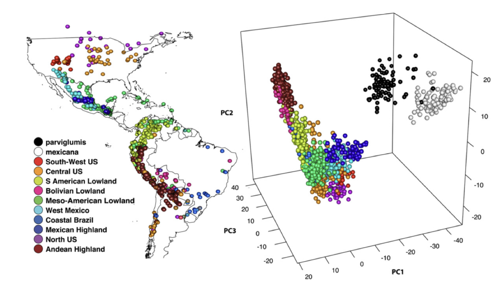
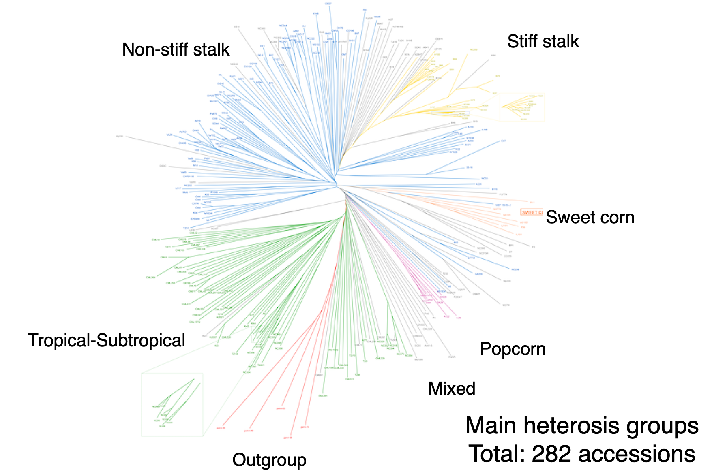
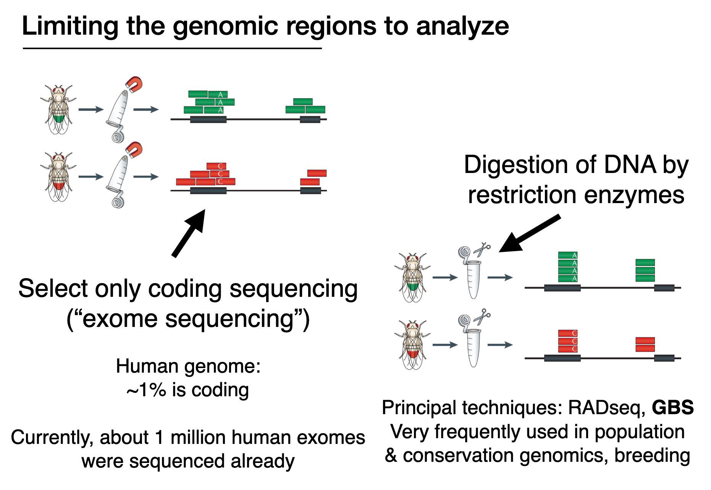

### Bioinformatics Tools

# Course 9

### Major aims  
- A basic understanding of phenotype-genotype association mapping (i.e. GWAS)
- Know key filter steps

### Report to submit

Please compile brief answers to the questions for your report ("Q1", "Q2", etc.). Depending on the question, you can add a short text, some code or a graphic. The answers can be in a text file, Word doc, etc.

You can work alone or in groups. Every student should submit their own report through Moodle though. No copy-pasting, please. Formulate answers in your own words.

## The maize dataset

As a manageable dataset to work with, we will use a diversity study of maize accessions covering the genetic diversity of the crop. At its center of origin in Mexico, farmers retained a very high degree of diversity.

  

59 native Mexican maize landraces, CIMMYT

  

Maize originated from annual teosinte (_Zea mays_ subspecies _parviglumis_) around 9,000 years BP. Co-existing teosinte species in Mexico include also _Zea mays_ subspecies _mexicana_.

  

We will analyze a set of 3093 SNPs (single nucleotide polymorphisms) of 282 inbred maize lines representing the global diversity in maize-breeding programs.

  

## Visualize the Genotyping-by-sequencing (GBS) data of maize

This genotyping method mainly exists to save money during sequencing. Instead of covering the entire genome, GBS allows to target a small subset of regions. This reduced number of variants (or SNPs) is often sufficient for analyses.

  

### Access the datasets

Before we download the datasets, let's navigate to a specific folder:

`cd $HOME`

This ensure that we all start the analyses in the same place (our home folder). All data is in the *datasets* folder.

```
### Download links from the github site
wget https://raw.githubusercontent.com/crolllab/teaching/master/Bioinformatics_Tools/Course_9_GWAS/datasets/MaizeDivPanel_282_genotypes_GBS.hmp.txt

wget https://raw.githubusercontent.com/crolllab/teaching/master/Bioinformatics_Tools/Course_9_GWAS/datasets/MaizeDivPanel_282_genotypes_INFO.txt

wget https://raw.githubusercontent.com/crolllab/teaching/master/Bioinformatics_Tools/Course_9_GWAS/datasets/MaizeDivPanel_282_phenotypes_33traits.txt
```
