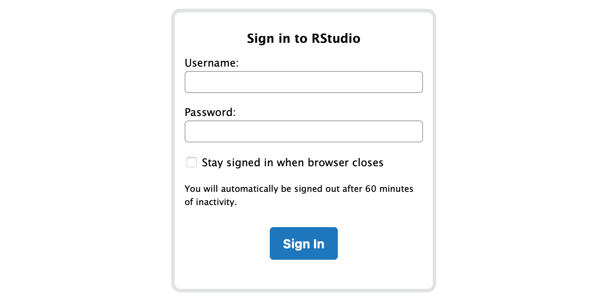
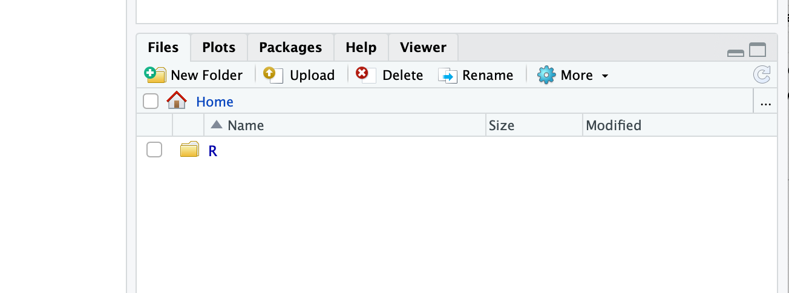

# Bioinformatics Tools

Prof. Daniel Croll, PD Dr. Nikolai Ivanov, Guido Puccetti, Baptiste Bovay

The course aims to introduce students to diverse areas of bioinformatics. We particularly focus on the needs of modern biology to treat large amounts of data and automate analyses procedures. The course is structured into lectures that introduce some key areas of bioinformatics followed by practicals on the computer to provide hands-on experience. Lecturers and students will be available for discussions of tools and approaches. The content of this course includes the following topics: 1- Introduction to Unix and scripting 2- Sequencing analysis 3- Genome assembly 4- Phenotype-genotype associations 5- Epigenetics

## How to access the "shell" and RStudio for the exercises

Our lab offers you the possibility to access RStudio Server. This allows you to use RStudio from a web browser.

**Access the RStudio website**
- Use a web browser to navigate to this site here: [http://legcompute2.unine.ch:8787](http://legcompute2.unine.ch:8787) (if no page is loading, you may issues with the VPN/are on wifi)

- Please request your username by adding your first name [here](https://docs.google.com/spreadsheets/d/1mE2cfUr14qA17YftYb2O4ualr3K9wKWXXtxEknLZuU0/edit?usp=sharing). Wait until your account was created (see the "OK" mark).  
- Your password will be: `bioinfo23`   
- Anything you save while using RStudio is on the server.
- To **to transfer a file to the server**: Find the "Files" tab (typically bottom right of the RStudio screen), click on "Upload" and select "Choose File". The file will upload and you can spot it now under "Files".  

  
  

  - To **recover a file from the server and save it on your computer**: Find the "Files" tab (typically bottom right of the RStudio screen), select the file(s) to download, click on "More" and then "Export...". This will get you to the download stage

  

  - Saving files from the server is likely most important to recover your written script.

## Evaluation modalities

Please refer to IS-Academia for details.

### Courses 1-3

Practical introduction to basic commands using a "shell", introduction to bioinformatics tools, basic exercises.

### Course on phenotype-genotype associations

A tutorial will be provided on Moodle / here.

### Courses on genome sequencing, assembly and epigenetics

Please refer yourself to the Moodle for the course documents.
