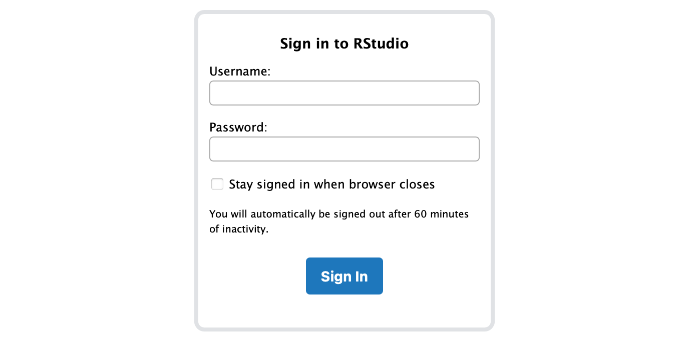
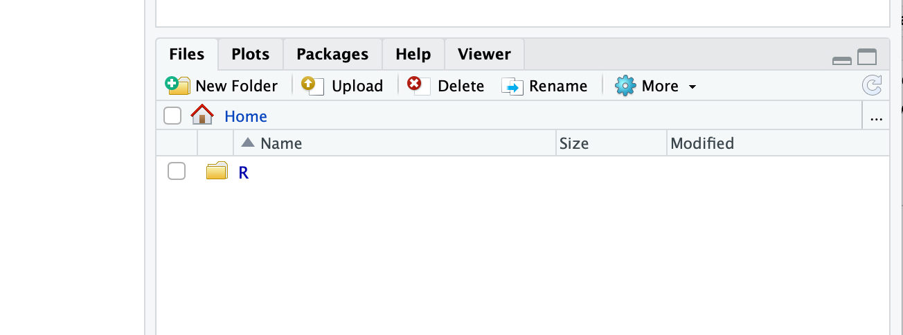
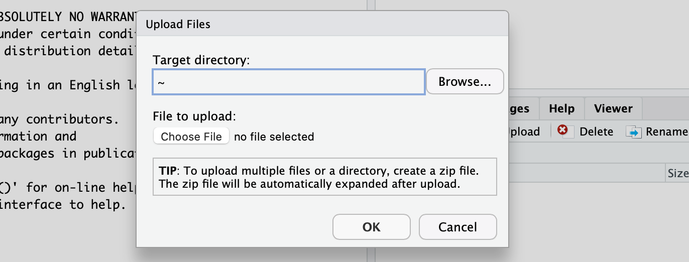
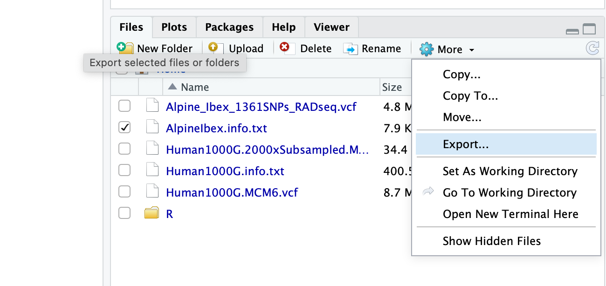

# Teaching activities by the Laboratory of Evolutionary Genetics

## Currently available courses

[TP Génétique évolutive](./TP_Génétique_évolutive) (3me année BSc)

[Bioinformatics Tools](./Bioinformatics_Tools) (1st year MSc)

## How to access the "shell" and RStudio for the different courses and exercises

Our lab offers you the possibility to access RStudio Server. This allows you to use RStudio from a web browser.

**Access the RStudio website**
- Access options, choose either to connect...
  - from a computer in a Unimail computer room
  - from a laptop/tablet connected to the `unine` wifi
  - from home through the UNINE VPN GlobalProtect (requires installing the software provided by SITEL)
- Then, use a web browser to navigate to this site here: [http://legcompute2.unine.ch:8787](http://legcompute2.unine.ch:8787)

- Username & password: check the course docs for your username and password

- **To transfer a file to the server**: Find the "Files" tab (typically bottom right of the RStudio screen), click on "Upload" and select "Choose File". The file will upload and you can spot it now under "Files".  

  
  

  - To **recover a file from the server and save it on your computer**: Find the "Files" tab (typically bottom right of the RStudio screen), select the file(s) to download, click on "More" and then "Export...". This will get you to the download stage

  

  - Saving files from the server is likely most important to recover your written script.
  - NB: Anything you save while using RStudio is and remains on the server until you decide to download the files.
