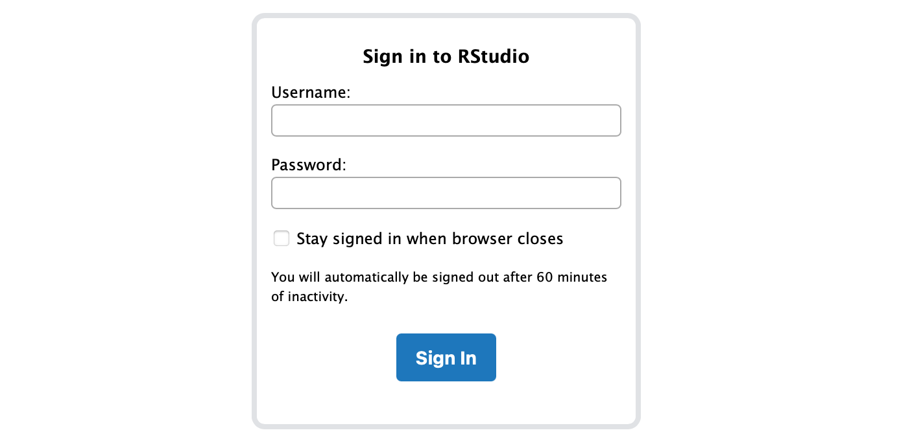
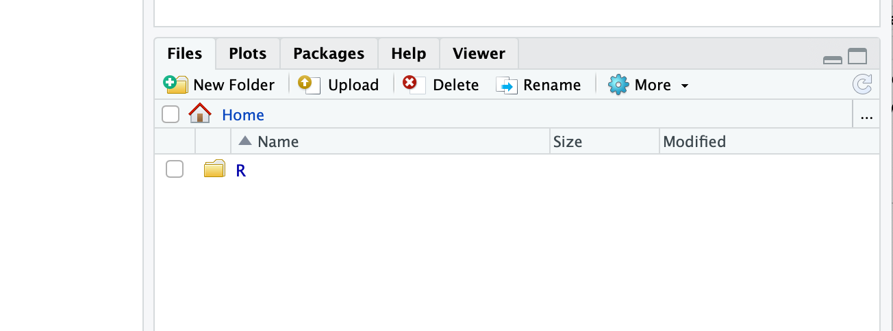
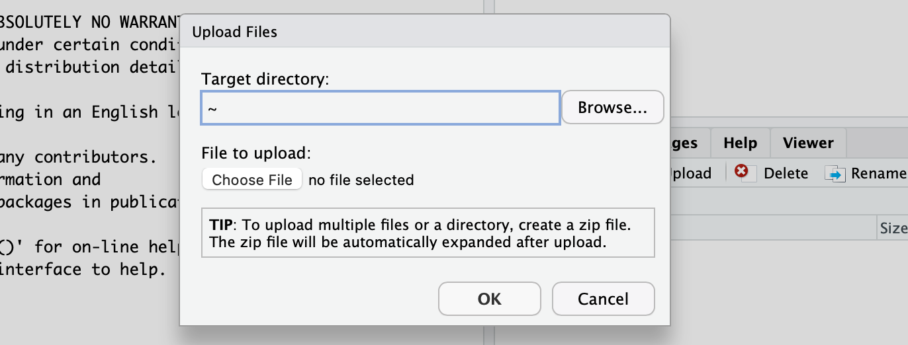
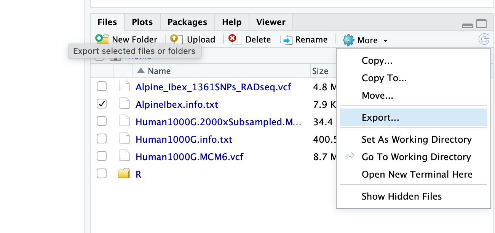

# Teaching activities by the Laboratory of Evolutionary Genetics

## Currently available courses

### [TP Génétique évolutive](./TP_Génétique_évolutive) (3me année BSc)
Travaux pratiques accompagnant le cours de génétique évolutive de 3ème année. Les séances couvrent les bases théoriques de la génétique des populations (loi de Hardy-Weinberg, sélection, dérive génétique, goulots d'étranglement) et leurs applications aux données génomiques humaines et à la génétique de la conservation des bouquetins des Alpes. Les étudiants acquièrent une expérience pratique de l'analyse de données génétiques sous R et RStudio.

### [Bioinformatics Tools](./Bioinformatics_Tools) (1st year MSc; until 2024-2025)
An introductory MSc course co-taught with PD Dr. Nikolai Ivanov covering key areas of bioinformatics. Topics include Unix and shell scripting, high-throughput sequencing analysis, genome assembly, and epigenomics. Each lecture is paired with a hands-on computer practical to build skills in handling large biological datasets and automating analysis pipelines.

### [Bioinformatics Applications](./Bioinformatics_Applications) (1st year MSc)
A practical course combining instructor-led introductory tutorials (VS Code, BASH, Git/GitHub) with student-led journal club-style tutorials on self-chosen bioinformatics topics. Students gain experience reading primary literature, presenting computational methods, and programming with version-controlled repositories.

### [Ecological Genomics](./Ecological_Genomics) (1st year MSc)
Tutorials at the interface of population genetics theory and conservation biology. Students simulate and analyse the fate of deleterious mutations in small populations using Wright-Fisher models, explore genetic load, purging, and mutation accumulation under different dominance regimes, and interact with custom Shiny apps to investigate how effective population size shapes genomic health in threatened species.

### [Microbiome Applications](./Microbiome_Applications) (1st year MSc)
A practical introducing students to microbiome data analysis in R using Quarto. Students summarise and visualise microbiome composition data, assess alpha and beta diversity, and compare microbial community structure across sample groups. All analyses run on a shared RStudio Server, requiring no local software installation.

## How to access the "shell" and RStudio for the different courses and exercises

Our lab offers you the possibility to access RStudio Server. This allows you to use RStudio from a web browser.

**Access the RStudio website**
- Access options, choose either to connect...
  - from a computer in a Unimail computer room
  - from a laptop/tablet connected to the `unine` wifi
  - from home through the UNINE VPN GlobalProtect (requires installing the software provided by SITEL)
- Then, use a web browser to navigate to this site here: [http://legcompute3.unine.ch:8787](http://legcompute3.unine.ch:8787)

- Username & password: check the course docs for your username and password

- **To transfer a file to the server**: Find the "Files" tab (typically bottom right of the RStudio screen), click on "Upload" and select "Choose File". The file will upload and you can spot it now under "Files".  

  
  

  - To **recover a file from the server and save it on your computer**: Find the "Files" tab (typically bottom right of the RStudio screen), select the file(s) to download, click on "More" and then "Export...". This will get you to the download stage

  

  - Saving files from the server is likely most important to recover your written script.
  - NB: Anything you save while using RStudio is and remains on the server until you decide to download the files.
