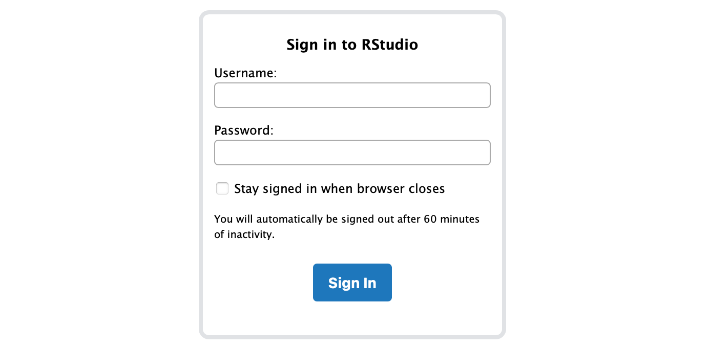
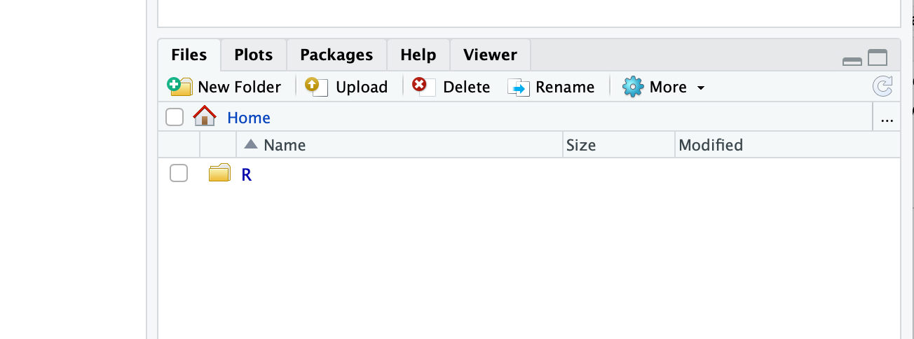
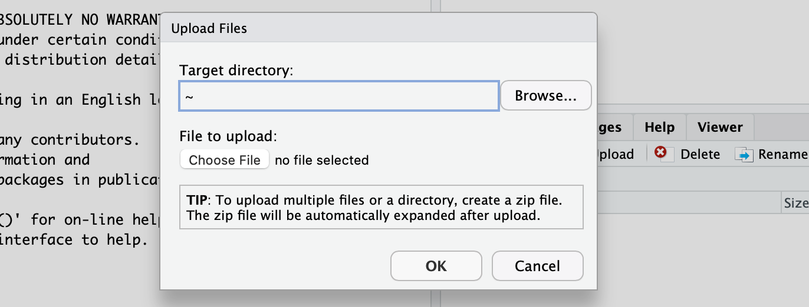
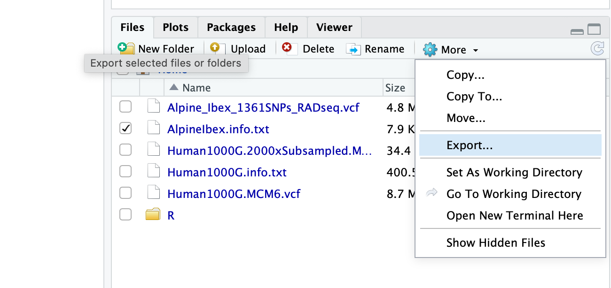

# TP Génétique évolutive

Prof. Daniel Croll et assistant.e.s

La génétique évolutive étudie les changements de gènes et fréquences de génotypes au sein des populations et espèces. Ces travaux pratiques fournissent une opportunité d’approfondir le cours « Génétique évolutive » (3me année). A travers des présentations, exercices et discussions, vous avez l’opportunité de développer des compétences dans le traitement de données génétiques y inclut :
- de mieux comprendre les bases théoriques de la génétique évolutive (e.g. Loi de Hardy-Weinberg, impact de la sélection ou goulot d’étranglement)
- de faire connaissance avec des applications de la génétique évolutive aux populations humaines (peuplement de la terre, assignements de génotypes individuels à des régions géographiques, détection de pression de sélection récente, etc.)
- gagner de l’expérience avec la génétique de la conservation appliquée aux bouquetins des Alpes (identification des risques d’appauvrissement génétique, évaluation de l’impact des plans de recolonisation, etc.).

Les travaux pratiques comprendront toujours une introduction au sujet, puis des exercises guidés avec l’appui de l’enseignant et des assistant.e.s.

## Utilisation de R et RStudio

### Utilisation de RStudio dans un navigateur web

Notre laboratoire peut vous fournir un accès à ses machines de calculs y inclut l'utilisation de RStudio dans un navigateur web. Nous préférons de vous fournir RStudio dans un navigateur web avec une connexion à distance au lieu de vous demander d'installer RStudio sur votre ordinateur. Ceci peut éviter certains problèmes d'installations de packages R.

**Suite aux attaques informatiques début 2022, seul l'accès décrit sur Moodle "Introduction TP"
ou par un PC dans les salles informatiques est possible**

**Marche à suivre:**  
- Suivez les instructions sur le Moodle "Introduction TP"

- L'utilisation de RStudio sur notre serveur est identique à RStudio installé sur votre ordinateur sauf:
  - le dossier de travail ne devrait pas être modifié
  - ignorer toute demande d'installer des packages lors du cours (`install.packages(...)`), procédez directement au chargement du package (`library(...)`). Demandez à votre assistante si un package semble être manquant.
  - par défaut, tout document enregistré va se trouver sur notre serveur
  - pour **transférer un document de votre ordinateur au serveur**: Identifiez le tab "Files" (en bas à droite de RStudio), cliquez sur "Upload" et puis "Choose File". Le fichier sera placé alors sur le serveur. Vous le trouverez sous "Files".

  
  

  - pour **récupérer un fichier du serveur vers votre ordinateur**: Identifiez le tab "Files" (en bas à droite de RStudio), sélectionnez le(s) fichier à télécharger, "More" et puis "Export...". Ceci permettra de procéder au téléchargement.

  

  - Cette méthode vous permettra aussi de récupérer votre script R enregistré sur le serveur.

## Mode d'évaluation

Référez-vous à IS-Academia pour plus de détails.

### TP 1 Introduction à R

Aucune évaluation

### TP 2-6

Document à rendre le jour par Moodle (ou selon l'accord avec l'enseignant) donnant les réponses aux questions (Q1...Qn). Merci de nommer votre document Nom_Prenom.

Répondez à chaque question de manière succincte (1-3 phrases sont souvent suffisantes). Si vous êtes obligés d'écrire du code ou générer des graphiques, les deux devraient en principe figurer dans le document.

Je m'attends à un effort correspondant aux heures des travaux pratiques et pas plus. Donc, si vous rencontrez des difficultés particulières sans résolution simple (installation des packages, etc.), il suffit de brièvement documenter les problèmes dans votre rapport.
