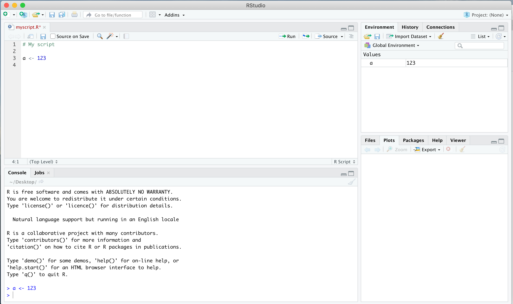
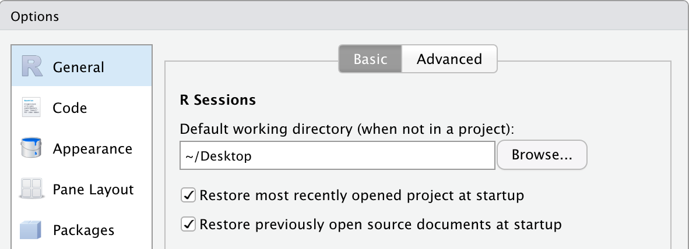

### TP Génétique évolutive 1


# Introduction à R


### Buts de ces travaux pratiques  

- Fonctionnement de RStudio
- Structure des données: variable, vecteur, data.frame
- Gestion des dossier, lecture et sauvegarde de fichiers
- Remanier des données avec `dplyr`
- Visualiser des données avec `ggplot2`

### Installations requises

- Télécharger R sur [CRAN](https://stat.ethz.ch/CRAN/)
- Télécharger la version gratuite de [RStudio](https://rstudio.com)


## Travailler avec RStudio  

- Commencez par lancer RStudio. Si `R` n'est pas encore installé correctement, il y aura un message d'erreur.
- Créez un nouveau fichier `R Script`. Utilisez toujours un tel fichier pour enregistrer votre code.



- Pour faciliter la lecture de fichier, déterminer la `working directory` soit dans les préferences ou en rajoutant la ligne de code tel que `setwd("/Users/dcroll/Desktop/")`. Ajustez l'emplacement.



- Utilisez la touche `tab` pour auto-compléter du code, des liens, des options, etc.

- En bas du script, vous voyez la console pour interagir avec R. Mais vous pouvez exécuter du code directement du script. Pour ceci, sélectionnez la/les lignes de code et appuyer sur les touches `cmd` + `enter` (sur Mac).  

## Travailler avec des variables, vecteurs et data.frames

Assigner des valeurs ou caractères à une variable

```
a <- 1
a

b <- "abc"
b

c <- TRUE
c
```

Faire des calculs simples

```
a <- 3
a + 1
a * 3

a^2

# fonctions simples
exp(a)
log(a)
sqrt(a)
sin(a)

b <- -4
abs(b)
```

Les vecteurs permettent d'enregistrer et de manipuler une série d'objets

```
vec <- c(1,2,3)
vec
vec * 5

vec <- 1:10
vec

vec <- seq(1,12,by=2)
vec

vec <- c(TRUE, FALSE, FALSE)
vec
vec == FALSE

vec <- c("lundi", "mardi", "mercredi")
vec
vec == "mardi"
```

On peut assigner des noms à des éléments d'un vecteur

```
working.hours <- c(8, 7, 10)
working.hours

names(working.hours) <- c("lundi", "mardi", "mercredi")
working.hours

working.hours["mardi"]
```

Echanntillonnage des éléments d'un vecteur

```
weekdays <- c("lundi", "mardi", "mercredi")
sample(weekdays, 1)
sample(weekdays, 2)
```

Les data.frames pour stocker des tableaux

```
df <- data.frame(weekday = c("lundi", "mardi", "mercredi"),
					hours = c(8,7,10),
					breaks = c(1,3,4))
df
# les colonnes se comportent comme des vecteurs
df$weekday

df$hours
mean(df$hours)

# sélection de valeurs
df$hours[df$weekday == "lundi"]

df[df$weekday == "lundi",]

df[df$hours > 7,]
```

## Lecture et enregistrement de fichiers  

La plupart des analyses `R` demandent l'importation de données. La source des données est soit
- vous même (et vous avez décidez sur le format)
- un collaborateur
- téléchargement d'une banque de données en ligne 

Les petits jeux de données sont souvent stockés sous format text (.txt) ou Excel (.xlsx).

Les problèmes les plus fréquents lors du chargement d'un fichier sont:
- on ne comprend pas la structure des données
- on ne comprend pas le format (e.g. JSON, VCF, GFF, POPGEN, FASTA, etc.)

### Quelques termes téchniques pour mieux gérer les erreurs lors de l'importation:  
- "Field delimiters" séparent les colonnes dans un fichier. Ceci peut être sous forme de tabulation, espace, virgule, etc.  
􏰀- "Special characters" (`\`, `"`, etc.)  
􏰀- "Text encoding" (UTF-8, etc.)  
􏰀- `class` et `colClasses`: la classe caractérise un type de données (e.g. `numeric`, `character`, `factor`). Une `colClass` définie le type de données dans une colonne.  
-􏰀 `header`: la première ligne d'un fichier qui peut optionnellement spécifier le nom de la colonne ("weight", "number of observations", etc.)  

Si tout marche bien, vous ne recevez aucun message d'erreur:

`data <- read.table("textfile.txt", header = T)`

[Attention: il faut que le fichier `textfile.txt` existe réellement dans le dossier spécifié]

Une erreur potentielle:

`data <- read.table("textfile.txt", header = T)`
`Error in scan(file = file, what = what, sep = sep, quote = quote, dec = dec, : line 1 did not have 3 elements`

Là, le problème est que le fichier ne contient pas un tableau "parfait" où chaque ligne contient le même nombre de données (ou colonnes). Il faut re-vérifier le fichier d'entrée ou spécificer correctement l'option `sep=`. Séparation par des espaces/tab/virgules? `sep=" "`, `sep="\t"`, `sep=","`?

Ajustez `header=T` ou `header=F`. Voir ci-dessus.

On peut faire sauter la lecture des premières lignes avec `skip = 2` (deux lignes)

Alternativement, on peut ignorer certaines colonnes: `colClasses = c(”integer”, ”NULL”, ”character”)` (après une colonne de chiffres, la deuxième colonne est ignorée, puis la troisième est lu comme des caractères)

### La lecture de fichiers Excel ou csv

```
install.packages("xlsx")
library("xlsx")

# lire la première feuille dans le fichier Excel
df <- read.xlsx("fichier_excel.xlsx, sheetIndex = 1, header=TRUE)
```

Alternativement, on peut exporter le fichier Excel sous format `.csv`
`df <- read.csv("fichier_excel.csv", header = T`

### Contrôler l'importatation d'un fichier lu dans `R`

Il est très important de bien vérifier que le fichier est correctement importé.

```
data <- read.table("textfile.txt", header = T)
head(data)
```

Est-ce que les colonnes sont proprement identifiées? Sinon, on peut facilement renommer les colonnes:

`names(data) <- c("Location", "Population", "Number of individuals")`

Contrôler le format des données par colonne:

`str(data)`

On peut résoudre certains problèmes (caractères convertis en facteur)

`read.table(..., stringsAsFactors = F)`

Le format des données peut être changé sous certaines conditions

```
as.character(df$column1)
as.factor(df$column1)
as.numeric(df$column1)
```
Faites extrêment attention quand vous essayez de convertir une colonne sous forme de `factor` en `character` ou `numeric`!

### Quelques exemples pour s'exercer

Vous trouvez dans le dossier [datasets](./datasets) une série d'exemples. La difficulté de réussire la lecture est variable.


## Les boucles `for`

R vous permet d'éxecuter des tâches en série ou boucle

```
## une boucle avec i prenant les valeurs de 1 à 5
for (i in 1:5) {

	print(i)

	}

## une boucle suivant un data.frame ligne par ligne
df <- data.frame(weekday = c("lundi", "mardi", "mercredi"),
					hours = c(8,7,10),
					breaks = c(1,3,4))

# la boucle fait autant de tour que lignes dans df
for (i in 1:nrow(df)) {
	
	# exemples d'opérations
	print(df[i,])

	print(df$breaks[i] * 60)
	
	# enregistrer des données dans la colonne "breaks.in.minutes"
	# on sélectionne la i-ième ligne
	df$breaks.in.minutes[i] <- df$breaks[i] * 60

	print(paste("fin de la boucle",i))
	}

# inspectez le résultat	
df
```


## Le traitement de données avec `dplyr`  

Consultez aussi le [cheatsheet](./cheatsheets/dplyr-cheatsheet.pdf). 

`dplyr` permet de manipuler et résumer des tableaux (data.frame) complexes y inclut
- de sélectionner une partie des données
- résumer selon différents critères
- rajouter des nouvelles colonnes ou variables
- regrouper les données selon un facteur (e.g. population, etc.)
- combiner toutes ces opérations en une commande (pipe)

```
install.packages("dplyr")

library(dplyr)

# exemple de données integrées
head(iris)

# sélectionner des colonnes
iris %>% select(Sepal.Length, Sepal.Width, Species)

# regrouper par espèce
iris %>% group_by(Species)

# regrouper par espèce et résumer les données
iris %>% group_by(Species) %>% summarise(average = mean(Sepal.Length)

# regénérer un data.frame
iris.summary.df <- iris %>% group_by(Species) %>% 
							summarise(average = mean(Sepal.Length) %>% 
							as.data.frame()
```

## Visualisation de données avec `ggplot2`

Consultez aussi le [cheatsheet](./cheatsheets/ggplot2-cheatsheet.pdf). 

```
install.packages("ggplot2")

library(ggplot2)

# utilisant les données mpg 
head(mpg)
```

### Etape 1: définir le jeu de données

- définir le jeu de données mpg and specify the aesthetics aes()
- définir les axes x et y (choix de colonnes dans mpg)
- le graphe est vide (encore!)

`ggplot(mpg, aes(x = hwy, y = cty))`

### Etape 2: rajouter une fonction

```
# geom_point() génère un scatter plot
ggplot(mpg, aes(x = hwy, y = cty)) + geom_point()
# shape, color et size peut être modifié
ggplot(mpg, aes(x = hwy, y = cty)) + geom_point(shape = 20, size = 5, color = "red")

# échanger les données à visualiser
ggplot(mpg, aes(x = as.factor(year), y = cty)) + geom_boxplot()

# faire un boxplot (x doit être un facteur)
ggplot(mpg, aes(x = as.factor(cyl), y = hwy)) + geom_boxplot()
ggplot(mpg, aes(x = as.factor(manufacturer), y = hwy)) + geom_boxplot()

# faire un histogram (on a seulement besoin de spécifier l'axe x)
ggplot(mpg, aes(x = hwy)) + geom_histogram()
ggplot(mpg, aes(x = hwy)) + geom_histogram(binwidth = 2)
```

### Jouer sur les paramètres et options

```
ggplot(mpg, aes(x = hwy, y = cty)) + geom_point(shape = 20, size = 5, color = "red", alpha = 0.2)
# the geom_point() parameters can  be used to represent data. Define it under aesthetics instead. 
ggplot(mpg, aes(x = hwy, y = cty)) + geom_point(aes(size = cyl), alpha = 0.5)
ggplot(mpg, aes(x = hwy, y = cty)) + geom_point(aes(size = cyl, color = manufacturer), alpha = 0.5)


### changer la représentations des axes (e.g. limits, breaks, etc.)
ggplot(mpg, aes(x = hwy, y = cty)) + geom_point(aes(size = cyl, color = manufacturer), alpha = 0.5) +
  scale_x_continuous(limits = c(5,50), breaks = seq(5,50,5)) +
  scale_y_continuous(limits = c(5,100))
  
### changer les labels
ggplot(mpg, aes(x = hwy, y = cty)) + geom_point(aes(size = cyl, color = class), alpha = 0.5) +
  labs(x = "highway mileage", y = "city mileage")
# google how to adjust legend labels!


### ajuster le theme(), faites une recherche google pour plus d'options
ggplot(mpg, aes(x = hwy, y = cty)) + geom_point(aes(size = cyl, color = manufacturer), alpha = 0.5) +
  labs(x = "highway mileage", y = "city mileage") +
  theme(axis.text = element_text(color = "black", size = 5))

```
  
### subdiviser un graphe selon un facteur

```
ggplot(mpg, aes(x = hwy, y = cty)) + geom_point(aes(size = cyl, color = manufacturer), alpha = 0.5) +
  labs(x = "highway mileage", y = "city mileage") +
  theme(axis.text = element_text(color = "black")) +
  facet_grid(. ~ manufacturer)
```

### enregistrer des graphes

```
ggsave("Plot.pdf")

# contrôler la mise en page en spécifiant les dimensions
ggsave("Plot.pdf", height = 6, width = 11)
```

## Traiter des séquences d'ADN

Nous allons analyser des fichiers VCF représentant des génotypes de grandes populations plus tard. Ici, nous regardons l'exemple de traitement de séquences d'ADN du format `fasta`.

On utilisera le fichier fasta de [FOXP2](./fasta/FOXP2_nucl.aligned.fasta) (cf. cours 2 Génétique évolutive)

```
install.packages(c("pegas", "seqinr"))

# les packages les plus utiles
library(ape)
library(pegas)
library(seqinr)

# create a DNAbin object containing the fasta sequence
FOXP2.DNAbin <- read.dna("FOXP2_nucl.aligned.fasta", format = "fasta")

# visualisation de l'alignment
image.DNAbin(FOXP2.DNAbin)

# évaluation de l'alignment, visualisation du polymorphisme
checkAlignment(FOXP2.DNAbin)

# faire un arbre phylogénétique simple
FOXP2.tree <- nj(dist(FOXP2.DNAbin))
plot(FOXP2.tree)

# changer l'enracinement
FOXP2.tree <- root(FOXP2.tree, outgroup = "Mus_musculus_var3")
plot(FOXP2.tree, main = "FOXP2 phylogeny")
```

## Troubleshooting

- Décortiquez une commande complexe en ses éléments les plus simples
- ...

[Suggérez vos propres astuces aux autres svp!] 