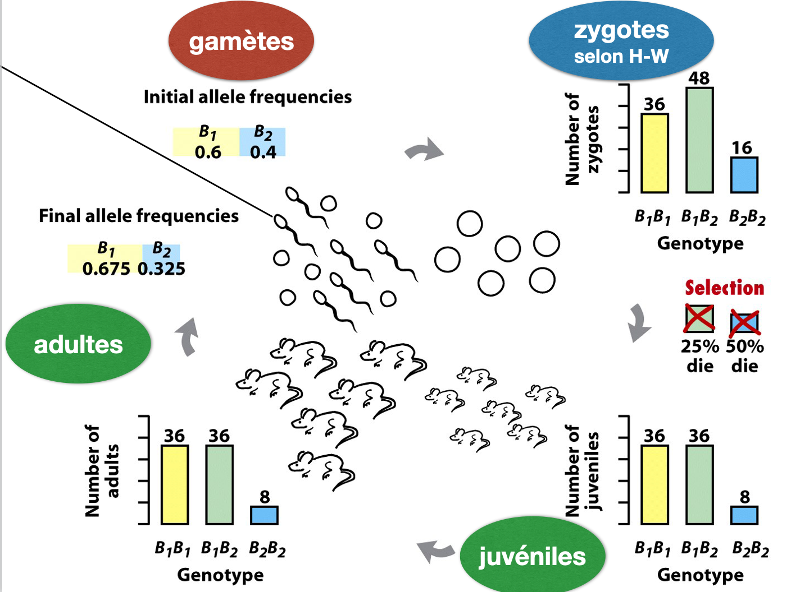
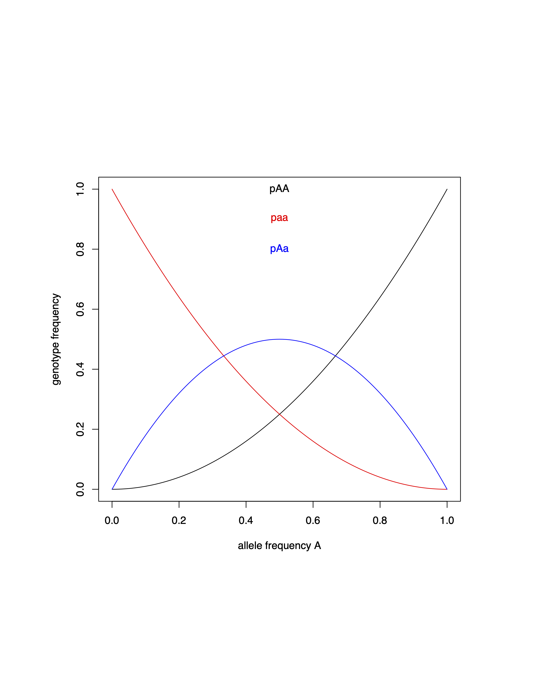
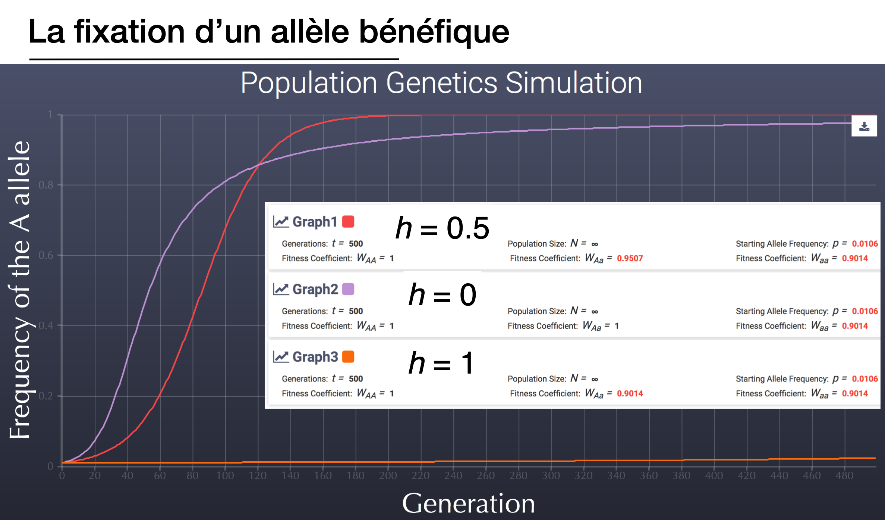
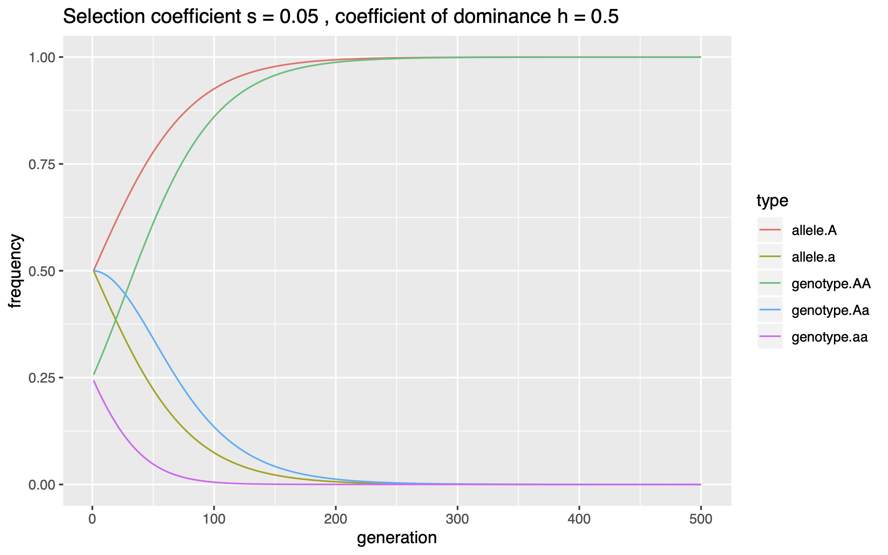

### TP Génétique évolutive 2


# Loi de Hardy-Weinberg et l'effet de la sélection


### Buts de ces travaux pratiques  
- Pouvoir visualiser la relation entre fréquences alléliques et génotypiques
- En ajoutant la sélection, calculer le changement en fréquences alléliques d'une génération à l'autre
- Intégrer ces changements en fréquences alléliques dans un modèle à plusieurs générations
- Comprendre l'impact de la coefficient de sélection s et le coefficient de dominance h




## La Loi de Hardy-Weinberg

L'application de la loi pour relier fréquences alléliques et génotypiques

On définit une fréquence de l'allèle A comme (p.ex. `0.2`):

`p <- 0.2`

Et puis pour l'allèle alternatif a:

`q <- 1 - p`

Q1: Ecrivez le code pour calculer les fréquences génotypiques AA, Aa et aa.


On peut visualiser la relation entre fréquences alléliques et génotypiques dans une population dans un graphe:

```
# on pourra utiliser ici x pour représenter p, "from" et "to" définissent l'interval des valeurs x
curve(x^2, from=0, to=1, ylab = "genotype frequency", xlab = "allele frequency A", col = "black")

text(0.5, 1, labels = "pAA", col = "black")
```

Q2 (optionnelle): Créez un graphe représentant à la fois pAA, pAa et paa. Astuce: l'option `curve(..., add = T)` vous permet de superposer des lignes dans un même graphique.



La Loi de Hardy-Weinberg préconise que les fréquences alléliques dans une population restent constantes (en absence de sélection, dérive, mutation et migration). Nous voulons tester si cette prédiction est bien vérifiée en construisant un petit modèle.

Pour simplifier la programmation nous allons écrire des fonctions `function()` pour différents éléments.

```
### Principe de base d'une fonction en R

add.two <- function(x) {

  result <- x + 2
  return(result)
}

add.two(5)

multiply.numbers <- function(x,y) {

  result <- x * y
  return(result)
}

multiply.numbers(4,8)
```

Q3 (optionnelle): Expliquez le principe d'une fonction en `R`? Quels sont les éléments à définir?


Définissons les variables de bases:

```
# Nous allons introduire le nombre de génotypes pour AA, Aa et aa dans un vecteur
genotypes.count <- c(3, 9, 50) # alors 3 génotypes d'AA, 9 Aa et 50 aa

# Normalisons les fréquences génotypiques à une somme de 1
genotypes <- genotypes.count / sum(genotypes.count)
```

### Fonction 1: Calcul des fréquences alléliques

Cette fonction prend comme variable le vecteur des fréquences génotypiques et retourne les fréquences alléliques (p: A; q: a). Dans le contexte d'une population, nous pouvons estimer la fréquence des gamètes (haploïdes) A et a produits par la génération des parents ayant les génotypes spécifiés.

```
get.Allele.Freq <- function(genotypes) {
  p <- genotypes[1] + 0.5*genotypes[2]
  q <- genotypes[3] + 0.5*genotypes[2]
  p <- p/(p+q)
  q <- 1 - p
  alleles <- c(p,q)
  return(alleles)
  }
```

NB: Votre fonction ci-dessus ne prend pas en compte le nombre de génotypes AA, Aa et aa mais les fréquences génotypiques. Donc une conversion en fréquences sera toujours nécessaire.

Q4: Testez la fonction ci-dessus et calculez les fréquences alléliques p et q pour les génotypes suivants AA: 39, Aa: 10, aa: 3. 


### Fonction 2: Calculez les fréquences génotypiques produits à partir d'un pool de gamètes

Nous supposons que les gamètes vont produire des zygotes selon un appariement aléatoire (pour respecter une condition de la Loi H-W).

```
# Nous allons introduire les fréquence alléliques dans un vecteur
alleles <- c(0.1, 0.9) #  (fréquence p(A) de 0.1 et fréquence q(a) de 0.9)

get.Progeny.GenoFreq <- function(alleles) {
  # selon la Loi H-W
  newAA <- alleles[1]^2
  newAa <- 2 * alleles[1] * alleles[2]
  newaa <- alleles[2]^2

  genotypes <- c(newAA, newAa, newaa)
  return(genotypes)

}

get.Progeny.GenoFreq(alleles)
```

Nous allons maintenant utiliser ces deux fonctions pour simuler l'évolution des fréquences alléliques dans une population. Notamment, le passage des parents aux gamètes et puis à la formation de zygotes.

Q5: Utilisez une boucle (voir TP 1) pour enchaîner les deux fonctions ci-dessus. Notamment, assurez que vous passez les valeurs produites par une fonction à l'autre. Choisissez des fréquences génotypiques pour démarrer la boucle et faites tourner la boucle une série de fois (e.g. 10x). Comparez les fréquences alléliques/génotypiques initiales et finales pour valider votre code.

Astuces: 

```
for (i in 1:10) {
  # votre code
}
```

```
#Les fonctions à enchainer
alleles <- get.Allele.Freq(genotypes)
genotypes <- get.Progeny.GenoFreq(alleles)
```

## L'impact de la sélection sur les fréquences génotypiques (et alléliques)

Ci-dessus, nous avons créé un petit modèle qui nous re-calcule les fréquences génotypiques et alléliques à chaque génération. La sélection peut être intégrée au niveau des génotypes produits à partir des fréquences alléliques. Le but est alors de modifier chaque fréquence génotypique en fonction de sa valeur sélective w (ou fitness).

Q6 (optionnelle): Cherchez dans le cours de génétique évolutive les définitions du coéfficient de sélection s et le coefficient de dominance h.

Reprenons la fonction suivante:

```
get.Progeny.GenoFreq <- function(alleles) {
  # selon la Loi H-W
  newAA <- alleles[1]^2
  newAa <- 2 * alleles[1] * alleles[2]
  newaa <- alleles[2]^2

  genotypes <- c(newAA, newAa, newaa)
  return(genotypes)

}
```

Le but est d'ajuster la fréquence génotypique par la valeur sélective du génotype. Donc, assumons que le génotype `AA` a le fitness maximum:

```
# coéfficient de sélection
s <- 0.05
# coéfficient de dominance
h <- 0.5 # donc, co-dominance

# Donc, nous pouvons définir le fitness de chaque génotype de manière suivante:
wAA <- 1
wAa <- 1 - h*s
waa <- 1 - s
```

Pour simplifier l'analyse, regroupons les valeurs de fitness dans un vecteur:
`geno.fitness <- c(wAA, wAa, waa)`

Nous avons alors la possibilité de modifier les fréquences génotypiques en appliquant `geno.fitness` sur un vecteur de `genotypes` comme ci-dessus
`genotypes * geno.fitness`

Vérifiez que le résultat correspond bien à vos attentes.

Q7: La procédure ci-dessus produit des fréquences génotypiques qui ne correspondent pas à une somme de 1. Comment allez-vous remédier ceci?


Q8: Modifiez votre boucle pour tester la validité de la Loi Hardy-Weinberg ci-dessus en intégrant une épisode de sélection sur les génotypes à chaque génération. La sélection sera alors l'étape finale de la boucle.


Q9: Testez pour des h entre 0, 0.5 et 1 si vous pouvez vérifier les analyses faites au cours (voir ci-dessous).




## Visualisations graphiques

Dans cette partie finale, nous voulons enregistrer l'évolution des fréquences alléliques et génotypiques au cours des générations. Ceci dans le but de pouvoir ensuite visualiser les changements à long terme.

Commencez par l'intégration d'un `data.frame` qui enregistre les données à chaque tour de la boucle (voir TP 1 pour une introduction aux boucles).

```
results.df <- data.frame(generation=numeric(),
                          allele.A=numeric(),
                          allele.a=numeric(),
                          genotype.AA=numeric(),
                          genotype.Aa=numeric(),
                          genotype.aa=numeric())
```

Le principe pour introduire des données (les fréquences pA, pa, pAA, pAa et paa) au cours de la simulation:

```
# à la génération "i" dans la boucle
results.df[i,"generation"] <- i
results.df[i, c("allele.A", "allele.a")] <- alleles
results.df[i, c("genotype.AA", "genotype.Aa", "genotype.aa")] <- genotypes
```

```
# pour tester le code en dehors d'une boucle en mettant i = 1
i <- 1
results.df[i,"generation"] <- i
results.df[i, c("allele.A", "allele.a")] <- alleles
results.df[i, c("genotype.AA", "genotype.Aa", "genotype.aa")] <- genotypes

```

### Visualisation de l'impact de sélection

Commencez par lancer la boucle enregistrant les résultats dans `results.df`.

```
library(reshape2)
library(ggplot2)

# remanier les données
results.m.df <- melt(results.df, id.vars = "generation", value.name = "frequency", variable.name = "type")

# visualisation
ggplot(results.m.df, aes(x = generation, y = frequency, color = type)) +
  geom_line() +
  scale_y_continuous(limits = c(0,1)) +
  labs(title = paste("Selection coefficient s =", s,", coefficient of dominance h =", h))

ggsave("Simulating_selection.pdf", width = 8, height = 5)


# Alternative: visualisation uniquement de pA
ggplot(results.m.df[results.m.df$type == "allele.A",], aes(x = generation, y = frequency, color = type)) +
  geom_line() +
  scale_y_continuous(limits = c(0,1)) +
  labs(title = paste("Selection coefficient s =", s,", coefficient of dominance h =", h))
```

Q10: Intégrez la collection des données avec `results.df` dans votre boucle simulant l'impact de la sélection (Q8). Explorez l'impact du `s`, `h` et les fréquences génotypiques au départ sur l'évolution.


