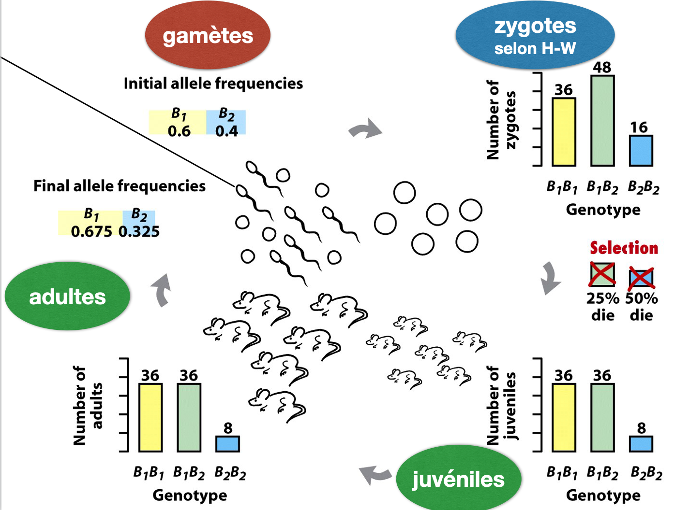

### TP Génétique évolutive 3

# Dérive génétique

### But de ces travaux pratiques

- Intégrer la dérive génétique dans un modèle de génétique de populations
- Analyser l'interaction de la dérive génétique et la sélection


## La dérive génétique et l'échantillonnage aléatoire

La dérive génétique peut être assimilée à un tirage au sort d'allèles contribuant à la reproduction. Le plus que le nombre d'allèles tiré au sort devient restreint, le plus que nous observons des fluctuations fortes d'une génération à l'autre. Le cas le plus extrême serait de tirer un seul allèle au sort contribuant à la prochaine génération.

Pour cette raison, nous voulons d'abord analyser l'effet d'un tel échantillonnage (répété) sur la distribution des valeurs observées.


[source: https://moderndive.com]

Faisons un tirage au sort de boules rouges et blanches.

```
# Définissons la fréquence des boules rouge
p <- 0.5    # alors la moitié est rouge

# Nombre de boules à tirer
n <- 10

## Tirons des valeurs 0 (rouge) et 1 (blanc)
# 10 boules avec remplacement, alors les boules ne s'épuisent jamais
# les proportions des boules sont données par p
sample(c(0,1), prob = c(p, 1-p), size = n, replace = T)

## la somme nous indique le nombre de boules blanches
sum(sample(c(0,1), prob = c(p, 1-p), size = 10, replace = T))
```

La prochaine étape est de répéter le tirage au sort pour observer la distribution des valeurs obtenues

```
## la fonction replicate() permet de répéter une fonction n fois
# nombre de répétitions
rep <- 1000
replicate(n = rep, sum(sample(c(0,1), prob = c(p, 1-p), size = n, replace = T)))

# nous enregistrons alors les valeurs obtenues
dist.val <- replicate(n = rep, sum(sample(c(0,1), prob = c(p, 1-p), size = n, replace = T)))

# Visualisation du nombre de boules blanches tirées par réplicat
hist(dist.val, col = "grey", main = paste(n, "balls"), xlim = c(0,n), xlab = "White balls")
```

Q1: Refaites le graphe en variant seulement le nombre de boules à tirer par répétition. Essayez e.g. 10, 100 et 1000 boules. Faites un graphe pour chaque cas. Quelles sont vos observations? Quel est l'impact du nombre de boules tirées par rapport à la distribution des boules blanches obtenues à travers les répétitions? Discutez brièvement ce que nous apprenons par rapport à la dérive génétique. En continuant la parallèle avec la dérive génétique, qu'est-ce que représente _p_ et _n_?

Nous voyons que si nous tirons peu de boules au total, nous observons une plus grande dispersion dans le nombre de boules blanches tirées au hasard. Avec un nombre plus élevé de boules tirées, nous avons une dispersion beaucoup plus faible (proportionnellement à n).

Nous pouvons utiliser cette observation pour mieux comprendre l'impact de la dérive génétique sur la composition des génotypes. Plus les individus se reproduisent à chaque génération ("tirer des génotypes pour la prochaine génération"), plus la fréquence des génotypes à la prochaine génération devient prévisible (= une dispersion plus faible). Autrement dit, l'importance du hasard est la plus forte si peu d'individus se reproduisent.


### Introduire la dérive génétique dans notre modèle

Nous voulons maintenant introduire la dérive génétique au niveau de la production des zygotes. Au lieu de déterminer les fréquences génotypiques selon la loi de Hardy-Weinberg (voir TP 2), nous allons tirer au hasard des allèles `A` et `a` du pool des gamètes pour former des génotypes `AA`, `Aa` et `aa`.



Définissons les fréquences alléliques  
```
p <- 0.2    # allèle A
q <- 1-p    # allèle a
```

Nous simplifions les calculs en représentant l'allèle A étant `1` et l'allèle a étant `0`. Tirons deux allèles du pool des gamètes (définit par p et q)
`sample(0:1, 2, c(q, p), replace = T)`


Nous allons générer 500 combinaisons d'allèles (= génotypes) sans utiliser une boucle (voir `replicate()` en haut). Puis, nous résumons les génotypes en faisant la somme des codes (0/1) utilisés pour les allèles. Allèle A étant `1` et l'allèle a étant `0`.

```
p <- 0.2    # allèle A
q <- 1 - p  # allèle a
n <- 500

sampled.genotypes <- replicate(n, sample(0:1, 2, c(q, p), replace = T))

# conversion en génotypes codé par 0, 1 et 2 (pour aa, aA et AA)
colSums(sampled.genotypes)
```

Résumons les génotypes produits ci-dessus sous la forme `genotypes <- c(40, 20, 10) # pour AA, Aa, aa` adoptée pour le TP 2.


```
# définir les variable
p <- 0.2    # allèle A
q <- 1-p    # allèle a
n <- 500

# tirage au sort de combinaisons d'allèles (= génotypes)
sampled.genotypes <- replicate(n, sample(0:1, 2, c(q, p), replace = T))

# générer les résumés par colonne
sampled.genotypes.012 <- colSums(sampled.genotypes)

# compter le nombre de génotypes selon le format 0, 1 et 2 (= somme des valeurs attribuées aux allèles)
aa <- sum(sampled.genotypes.012 == 0)
Aa <- sum(sampled.genotypes.012 == 1)
AA <- sum(sampled.genotypes.012 == 2)

# remplir un vecteur avec le résultat du comptage
genotypes.count <- c(AA, Aa, aa)
```

Ecrivons une fonction analogue à `get.Progeny.GenoFreq(alleles)` (voir TP 2) qui prend comme valeurs des fréquences alléliques et un nombre de génotypes à échantillonner `n`. La fonction devrait produire des fréquences génotypiques soumises à la dérive génétique. Appelez la fonction `Progeny.GenoFreq.withDrift(alleles, n)`. Vous voyez qu'on doit pouvoir spécifier la taille de la population à la fonction (n). 


```
alleles <- c(0.1, 0.9) #  (fréquence p(A) de 0.1 et fréquence q(a) de 0.9)
n <- 100

Progeny.GenoFreq.withDrift <- function(alleles, n) {
  
  p <- alleles[1]
  q <- alleles[2]

  sampled.genotypes <- replicate(n, sample(0:1, 2, c(q, p), replace = T))
  sampled.genotypes.012 <- colSums(sampled.genotypes)

  newaa <- sum(sampled.genotypes.012 == 0)
  newAa <- sum(sampled.genotypes.012 == 1)
  newAA <- sum(sampled.genotypes.012 == 2)

  genotypes <- c(newAA, newAa, newaa)
  genotypes <- genotypes / sum(genotypes)

  return(genotypes)
  }

# test de l'effet de la dérive
Progeny.GenoFreq.withDrift(alleles, n)
Progeny.GenoFreq.withDrift(alleles, n)
Progeny.GenoFreq.withDrift(alleles, n)
```

Q2: Reprenez le code proposé dans le code complet pour la tâche finale du TP 2 (ou votre version du code). Enlevez la partie du code qui intègre la sélection et rajoutez la fonction qui implémente la dérive génétique. Enregistrez un `results.df` comme proposé au TP 2.


Q3: Réutilisez le code servant à visualiser `results.df` (TP 2). Etudiez l'impact d'une taille de population `n` variable dans des graphes séparés (ou conjoints). Suggestion: visualisez uniquement une fréquence allélique (e.g. pA) pour simplifier la présentation.


Q4: Intégrez votre modèle de sélection (TP2 ou corrigé) et le modèle de dérive génétique (ce TP) dans une seule boucle. Décidez sur la séquence des trois étapes (e.g. production des gamètes, dérive génétique, sélection). Vérifiez bien que vous êtes consistent dans l'utilisation des variables (e.g. toujours `alleles` et `genotypes`).

Voici une proposition de code pour intégrer les deux modèles. Vous pouvez bien sûr adapter le code à votre propre version.

```

```


Q5: Identifiez grossièrement des conditions limites (soit pour _n_ ou _s_) où la dérive génétique prend le dessus sur la sélection et domine fortement l'évolution des fréquences alléliques.
