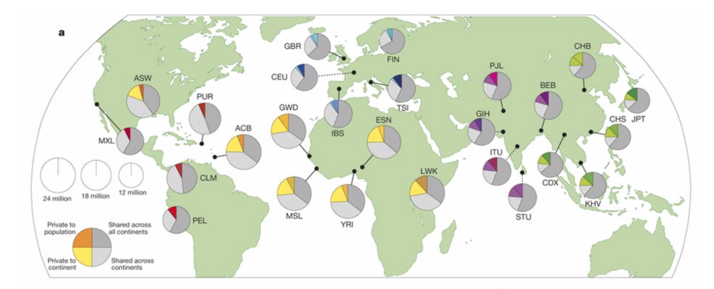
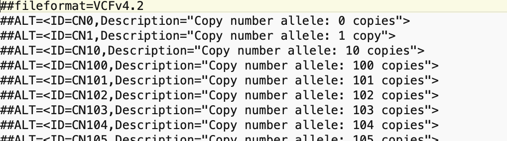
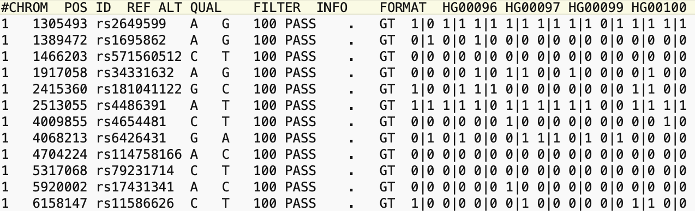
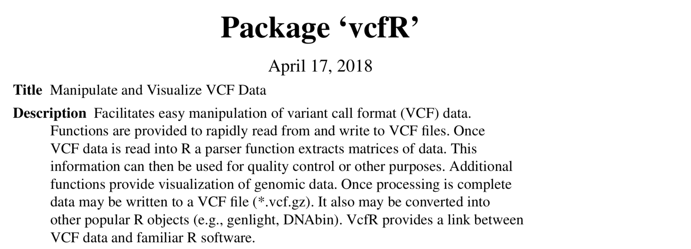

### TP Génétique évolutive 4


# Analyses de polymorphisme et structuration des populations humaines


### Buts de ces travaux pratiques

- Comprendre la structure d'un jeu de données majeur pour la génétique des populations.
- Savoir faire des manipulations de base d'un tel jeu de données.
- Connaître les outils principaux de visualisations de la structuration des populations (PCA et F<sub>ST</sub>).

### Concepts importants

Référez-vous aux slides du cours "Génétique évolutive" si besoin.

- Techniques de séquençage, SNP, MAF (minor allele frequency)
- Principal component analyses (PCA), F<sub>ST</sub>
- Peuplement de la terre par l'homme. Pour les intéressés: [Nielsen et al. 2017](https://www.nature.com/articles/nature21347)

### Les données: "The 1000 Genomes Project"  
- La publication principale est apparue dans Nature vol 526, pages 68–74, 2015: [https://www.nature.com/articles/nature15393](https://www.nature.com/articles/nature15393)
- 2504 individus de 26 populations à travers le monde
- 84.7 millions SNP identifiés

Q1: Quelle était la motivation principale d'étudier la diversité génétique globale de l'homme (selon les auteurs)?



### Les données simplifiées pour ces TP

- Facultatif: Explorez les données SNP mises à disposition en utilisant un navigateur FTP. L'adresse suivant doit être utiliser: ftp://ftp.1000genomes.ebi.ac.uk/vol1/ftp/release/20130502 (le login doit être "anonymous" ou en tant que guest)  




  

- Pour ces TPs, nous avons généré un sous-échantillonnage des SNPs (1 sur 2000) pour ne pas alourdir trop les analyses. Le fichier complet serait d'environ 1 TB. Le fichier préparé pour les TPs s'appelle `Human1000G.2000xSubsampled.MAF0.05.recode.vcf` (format VCF). Ce fichier est aussi filtré pour une fréquence allélique mineure (MAF) >0.05. Donc, les allèles rares n'y figurent plus!

- Les fichiers sont disponibles ci-dessus. Cliquez sur le fichier correspondant et puis sélectionnez "Raw" ou "Download". Enregistrez le fichier au bon endroit sur votre ordinateur.

- Attention: Assurez vous que votre ordinateur n'a pas modifié l'extension des fichiers (e.g. `.vcf` en `.vcf.txt`)


## Introduction à l'analyse de fichiers VCF

- Ouvrez le fichier VCF à l'aide d'un éditeur de texte. Repérez la partie supérieure (`# ...`) qui résume de l'informations sur le contenu du fichier et les analyses faites ultérieurement. Puis, la partie inférieure identifiant chaque SNP (1 par ligne) avec sa position (`POS`) sur un chromosome spécifique (`CHROM`). Notez que `0` et `1` décrivent les allèles (0 correspond à l'allèle "REF" qui est connu du génome de référence, 1 correspond à l'allèle alternatif "ALT"). Un génotype d'un individu est donc représenté par exemple comme "0|0" (homozygote) ou "0|1" (hétérozygote).

- Il existe de nombreux packages en R permettant la manipulation de fichiers VCF, mais la fonctionnalité offerte par ces packages est rarement cohérente. Il est donc important d'évaluer le potentiel du package avant d'entamer une analyse spécifique. Nous allons utilsé `vcfR` et `adegenet`.

  

Le point de départ: Définissez votre espace de travail, téléchargez le fichier `Human1000G.2000xSubsampled.MAF0.05.recode.vcf` dans le même dossier  

```
# à ajuster si besoin!
# setwd("/home/ge-daniel/some_folder")

# obtenir les fichiers
system("wget https://raw.githubusercontent.com/crolllab/teaching/master/TP_Génétique_évolutive/TP_4_Structure_pop_humaines/Human1000G.2000xSubsampled.MAF0.05.recode.vcf")
system("wget https://raw.githubusercontent.com/crolllab/teaching/master/TP_Génétique_évolutive/TP_4_Structure_pop_humaines/Human1000G.info.txt")

# L'installation n'est pas nécessaire si vous utilisez notre serveur
# install.packages(c("vcfR", "ggplot2", "adegenet"))

# chargez les packages
library(vcfR)
library(adegenet)
library(ggplot2)

# lisez le fichier VCF & faites la conversion en objet genlight
vcf <- read.vcfR("Human1000G.2000xSubsampled.MAF0.05.recode.vcf")
allchr.snps <- vcfR2genlight(vcf)
```

Q2: Combien d'individus et de variants (SNPs) sont compris dans ce fichier réduit?

## Assigner les individus aux populations et régions d'origine

Télécharger le fichier "Human1000G.info.txt". Ce fichier résume l'information sur chaque individu inclut dans les données.

```
# lire le fichier
info.df <- read.table("Human1000G.info.txt", header=T, sep="\t")

# voir les catégories
head(info.df)
table(info.df$Population.name)
table(info.df$Superpopulation.name)

### ci-dessous vous avez trois options de catégoriser les individus
# assignez les individus aux populations (Population)
pop(allchr.snps) <- info.df$Population.name[match(indNames(allchr.snps), info.df$Sample.name)]

# ALTERNATIVEMENT: aux continents/régions (Superpopulation)
# pop(allchr.snps) <- info.df$Superpopulation.name[match(indNames(allchr.snps), info.df$Sample.name)]

# ALTERNATIVEMENT: au sexe
# pop(allchr.snps) <- info.df$Sex[match(indNames(allchr.snps), info.df$Sample.name)]
```

Q3: Faites un graphique simple résumant d'abord les nombres d'échantillons par population et puis super-population (régions).

## Sélection de positions, chromosomes ou individus

```
# sélectionner les premiers éléments de la matrice des génotypes (un example)
as.matrix(allchr.snps)[1:3,1:3]

# accès à l'intégralité des informations (positions, chromosomes, identifiants des loci)
allchr.snps@position
allchr.snps@chromosome
allchr.snps@loc.names

# vous pouvez identifier le génotype d'un individu en sélectionnant l'information dans la matrice
as.matrix(allchr.snps)
# as.matrix(allchr.snps)["individu", "nomDuSNP"]

# en utilisant ces pièces d'information, créer un dataframe
allchr.df <- data.frame(position = allchr.snps@position, chromosome = allchr.snps@chromosome, SNPid = allchr.snps@loc.names)
# générer l'ordre correct des chromosomes
allchr.df$chromosome <- factor(allchr.df$chromosome, levels = c(1:22, "X"))

# Nombre de SNP inclut par chromosome
SNP.per.chr <- as.data.frame(table(allchr.df$chromosome))
qplot(x = allchr.df$chromosome, geom = "bar", xlab = "Chromosomes", ylab = "Number of SNPs")
```

Q4 (optionnelle): Calculez le nombre de SNP par megabases de chromosomes (i.e. densité). Est-ce que les chromosomes diffèrent en densité?  
[NB: l'information sur la taille des chromosomes humains est facilement accessible en ligne.]

Q5 (optionnelle): Quel est le génotype de l'individu "HG02334" à la première position du chromosome 2?


```
# visualiser la densité des SNP
ggplot(allchr.df, aes(x = position/1000000)) + geom_histogram(binwidth = 10) +
  labs(x = "Position sur le chromosome (en Mb)", y = "Densité SNP") +
  scale_x_continuous(breaks = seq(0,1000,50)) +
  theme(panel.background = element_blank()) +
  facet_grid(. ~ chromosome, space = "free", scales = "free")

ggsave("SNPdensity.pdf", width = 20, height = 4)
```

Q6: Discutez une explication possible du pic principal de densité des SNPs.

## Fréquences alléliques et allèles mineurs

Une propriété importante d'une population est la distribution des fréquences alléliques. On peut extraire l'information de la fréquence de l'allèle alternatif comme ci-dessous:

```
# extraction des fréquences de l'allèle alternatif (l'allèle ne figurant pas dans le génome de référence)
alt.allele.freq <- glMean(allchr.snps)

# pour une population seulement
population <- "Yoruba"

alt.allele.freq.pop <- glMean(allchr.snps[pop(allchr.snps) == population,])

qplot(alt.allele.freq.pop, geom = "density", xlab = "Alternative allele frequency")
```

Q7 (optionnelle): Modifier le code pour visualiser les fréquences d'allèles mineurs (MAF).

Proposition de solution:
```
minor.allele.freq[minor.allele.freq > 0.5] <- 1-minor.allele.freq[minor.allele.freq > 0.5]

population <- "Bengali"

alt.allele.freq.pop <- glMean(allchr.snps[pop(allchr.snps) == population,])

minor.allele.freq.pop <- alt.allele.freq.pop

minor.allele.freq.pop[minor.allele.freq.pop > 0.5] <- 1-minor.allele.freq.pop[minor.allele.freq.pop > 0.5]

qplot(minor.allele.freq.pop, geom = "density", xlab = "Minor allele frequency")
```

NB: Ce jeux de données est filtré pour éliminer les SNP avec allèles très rares (MAF < 0.05) pour des raisons pratiques (données trop volumineuses)


Q8: Générer les plots pour deux populations que vous supposez de montrer un contraste au niveau des spectres de fréquences d'allèles mineurs (MAF). Décrivez brièvement (et verbalement) les différences au niveaux des spectres.

NB: ajustez `population <- "Bengali"` pour sélectionner une autre population.

## Fréquences génotypiques

Les fréquences génotypiques permettent d'estimer entre autres les taux d'hétérozygotie.

```
# accès aux données génotypiques se fait en transformant l'object allchr.snps
allchr.geno.df <- as.data.frame(allchr.snps)

# identification des hétérozygotes (identifiés toujours par "1")
allchr.het <- allchr.geno.df == 1

heterozygosity.perSNP.perPOP <- aggregate(allchr.het, as.data.frame(allchr.snps$pop), function(x) {sum(x) / length(x)})
heterozygosity.df <- data.frame(population = heterozygosity.perSNP.perPOP[,1], MeanHeterozygosity = rowMeans(heterozygosity.perSNP.perPOP[,-1]))

ggplot(heterozygosity.df, aes(x = reorder(population, -MeanHeterozygosity), y = MeanHeterozygosity, fill = population)) +
  geom_bar(stat = "identity") +
  coord_cartesian(ylim = c(0.25, 0.33)) +
  labs(x = "Population", y = "Average heterozygosity") +
  theme(axis.text = element_text(colour = "black"), axis.text.x = element_text(angle = 45, hjust = 1), legend.position="none")

ggsave("Population_heterozygosity.pdf", width = 6, height = 4)
```

Q9: Selon vos connaissances sur les voies de colonisation de l'humain, prédisez grossièrement les différences en taux d'hétérozygotie entre populations (1-2 phrases). Puis, comparez votre prédiction avec le graphique généré ci-dessus.

Q10 (optionnelle): En utilisant la procédure ci-dessus, calculez l'hétérozygotie pour la population "British" par chromosome.

Proposition de solution:
```
heterozygosity.perSNP.perPOP.t <- as.data.frame(t(heterozygosity.perSNP.perPOP[,-1]))
names(heterozygosity.perSNP.perPOP.t) <- heterozygosity.perSNP.perPOP[,1]
heterozygosity.perSNP.perPOP.t$SNPid <- row.names(heterozygosity.perSNP.perPOP.t)
heterozygosity.perSNP.perPOP.fullinfo <-  merge(heterozygosity.perSNP.perPOP.t, allchr.df, by="SNPid")
heterozygosity.perSNP.perPOP.fullinfo$chromosome <- factor(heterozygosity.perSNP.perPOP.fullinfo$chromosome, levels = c(1:22, "X"))
barplot(tapply(heterozygosity.perSNP.perPOP.fullinfo$British, INDEX = heterozygosity.perSNP.perPOP.fullinfo$chromosome, FUN = mean))
```

## Analyse en composantes principales

Voici le code pour visualiser le produit d'une analyse en composantes principales.

```
# étape longue (~5 minutes!)
allchr.pc <- glPca(allchr.snps, nf = 2)

# accélération: sélection des premiers 300 SNP mais vous perdez significativement en résolution!
# allchr.pc <- glPca(allchr.snps[,1:300], nf = 2)


barplot(allchr.pc$eig[1:10])

pca.data <- as.data.frame(allchr.pc$scores)

# essayer les deux alternatives pour définir les populations (continent ou population)
pca.data$pop <- info.df$Population.name[match(row.names(pca.data), info.df$Sample.name)]
pca.data$region <- info.df$Superpopulation.name[match(indNames(allchr.snps), info.df$Sample.name)]

## visualisation de la structure
ggplot(pca.data, aes(x = PC1, y = PC2, fill=region, color=region)) +
  geom_point(size = 3, alpha = 0.5)

ggsave("PCA_structure.pdf", width = 12, height = 10)

## visualisation de la structure, ajout de texte identifiant les populations
ggplot(pca.data, aes(x = PC1, y = PC2, fill=region, color=region)) +
  geom_point(size = 3, alpha = 0.5) +
  geom_text(aes(x = PC1, y = PC2, label = pop), size = 2)

ggsave("PCA_structure_poptext.pdf", width = 12, height = 10)
```

Q11: Qu'est-ce que signifie le barplot? Cherchez pour "eigenvector" en lien avec "PCA" si besoin.

Q12: En visualisant les "super-populations" (continents/régions) et puis les "populations", interprétez la structuration observée dans la PCA. En s'appuyant sur les voies de colonisations majeures, quelles sont les raisons probables du regroupement? Est-ce que vous trouvez des contradictions à vos prédictions?

Q13: Un petit nombre d'individus non-africains se trouvent très proche du cluster africain. Explications possibles à votre avis?


## Analyse de F<sub>ST</sub> par paires de populations

Pour effectuer au plus simple une analyse de F<sub>ST</sub>, il faudra convertir le fichier `VCF` dans un objet `genind`.

```

# L'installation n'est pas nécessaire!
# install.packages(c("hierfstat", "gplots", "RColorBrewer"))

# chargez les packages
library(hierfstat)
library(gplots)
library(RColorBrewer)

# lire le fichier VCF & conversion en format genind
vcf <- read.vcfR("Human1000G.2000xSubsampled.MAF0.05.recode.vcf")
allchr.snps.genind <- vcfR2genind(vcf)

# lire le fichier
info.df <- read.table("Human1000G.info.txt", header=T, sep="\t")

# voir les catégories
head(info.df)


### Ci-dessous vous avez deux options de catégoriser les individus
# assignez les individus aux populations (Population)
pop(allchr.snps.genind) <- info.df$Population.name[match(indNames(allchr.snps.genind), info.df$Sample.name)]

# ALTERNATIVEMENT: par continent/région (Superpopulation)
# pop(allchr.snps.genind) <- info.df$Superpopulation.name[match(indNames(allchr.snps.genind), info.df$Sample.name)]

# Estimation des Fst pour toutes les paires de populations (étape lente! plusieurs minutes)
allchr.snps.hs <- genind2hierfstat(allchr.snps.genind)

# sélection de 300 loci (= rapide)
fst <- pairwise.neifst(allchr.snps.hs[,1:300])
# ALTERNATIVE: sélection de >1000 loci (plus précis mais plus lent)
# fst <- pairwise.neifst(allchr.snps.hs)

rownames(fst) <- dimnames(fst)[[1]]
colnames(fst) <- dimnames(fst)[[2]]

# Optionnel: changer l'ordre d'apparition des populations pour la visualisation
# pop.order <- unique(pop(allchr.snps.genind))
# Définissez l'ordre souhaité ci-dessous (l'exemple est celui des régions! )
pop.order <- c("Yoruba", "Gambian Mandinka", "Esan", "Mende", "Luhya", "African-Caribbean", "African-American SW", "British", "Finnish", "CEPH", "Tuscan", "Spanish", "Mexican-American", "Puerto Rican", "Colombian", "Peruvian", "Indian", "Punjabi", "Bengali", "Gujarati", "Sri Lankan", "Southern Han Chinese", "Dai Chinese", "Kinh Vietnamese", "Han Chinese", "Japanese")
fst <- fst[pop.order, pop.order]

# Visualisation des Fst
pdf(paper = "a4", "Human.pairwiseFST.pdf")
heatmap.2(fst, revC = F, Rowv = F, Colv = F, margins = c(10, 10), dendrogram = "none", scale="none", trace="none", density.info="none", col = rev(brewer.pal(11, "Spectral")), key.xlab="Fst")
dev.off()
```

Q14: Faites l'analyse au niveau des pays/populations comme indiquée ci-dessus. Décrivez brièvement le résultat obtenu et conciliez les valeurs relatives de F<sub>ST</sub> avec nos connaissances sur le peuplement de la terre par l'humain.
