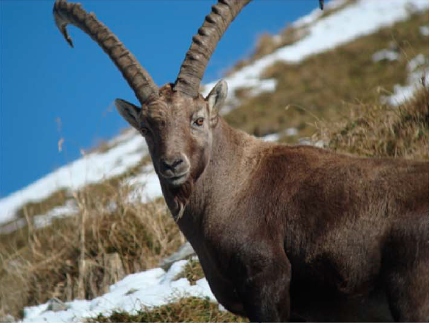
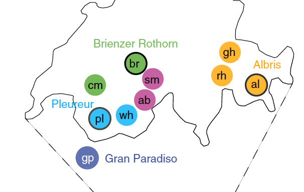

### TP Génétique évolutive 5


# Analyses des goulots d'étranglements subis par les bouquetins



### Buts de ces travaux pratiques

- Analyser la structure des populations des bouquetins (Capra ibex)
- Comprendre l'impact des goulots d'étranglement sur la diversité et différenciation des populations

### Concepts importants

Référez-vous aux slides du cours "Génétique évolutive" si besoin.

- Techniques de séquençage, SNP
- Principal component analyses (PCA), F<sub>ST</sub> et F<sub>IS</sub>
- Effets des goulots d'étranglement

### Les données: Grossen et al. 2018

- Les données pour ces travaux pratiques ont été générées dans le cadre d'une étude scientifique: [Grossen et al. 2018](./images/Grossen_et_al-2018-Evolutionary_Applications.pdf)
- Le génotypage s'est fait à l'aide de la technique [RAD-seq](https://en.wikipedia.org/wiki/Restriction_site_associated_DNA_markers) qui permet le génotypage à coût raisonnable d'un grand nombre d'individus
- Les données à disposition comprennent: 135 individus et 1361 SNPs à travers le génome



Les populations suivantes sont incluses: gp, Gran Paradiso; al, Albris; br, Brienzer Rothorn; pl, Pleureur; ab, Aletsch Bietschhorn; sm, Schwarz Mönch; cm, Cape au Moine; gh, Graue Hörner; rh, Rheinwald; wh, Weisshorn. Les populations avec cercle noir représentent les lieux d'introductions primaires en Suisse. Voir [Grossen et al. 2018](./images/Grossen_et_al-2018-Evolutionary_Applications.pdf) pour plus de détails.

Q1: Est-ce que les bouquetins ibériques ont aussi souffert d'une quasi-extinction selon l'étude ci-dessus?

## La structuration des populations réintroduites de bouquetins

Nous allons suivre une procédure très similaire qu'aux TP4. Référez-vous au code des TP4 si les explications ci-dessous vous paraissent incomplètes ou s'il vous faut plus d'explications.

```

# à ajuster si besoin!
# setwd("/home/ge-daniel/some_folder")

# obtenir les fichiers
system("wget https://raw.githubusercontent.com/crolllab/teaching/master/TP_Génétique_évolutive/TP_5_Goulots_bouquetins/Alpine_Ibex_1361SNPs_RADseq.vcf")
system("wget https://raw.githubusercontent.com/crolllab/teaching/master/TP_Génétique_évolutive/TP_5_Goulots_bouquetins/AlpineIbex.info.txt")

# L'installation n'est pas nécessaire si vous utilisez notre serveur
# install.packages(c("vcfR", "ggplot2", "adegenet", "hierfstat", "gplots", "RColorBrewer", "plyr", "reshape2"))

# chargez les packages
library(vcfR)
library(adegenet)
library(ggplot2)
library(hierfstat)
library(gplots)
library(plyr)
library(reshape2)
library(RColorBrewer)

# lire le fichier VCF & conversion en format genind et genlight
vcf <- read.vcfR("Alpine_Ibex_1361SNPs_RADseq.vcf")
allchr.snps.genind <- vcfR2genind(vcf)
allchr.snps <- vcfR2genlight(vcf)

# en utilisant ces pièces d'information, créez un dataframe
allchr.df <- data.frame(position = allchr.snps@position, chromosome = allchr.snps@chromosome, SNPid = allchr.snps@loc.names)
# générez l'ordre correct des chromosomes
allchr.df$chromosome <- factor(allchr.df$chromosome, levels = c(paste0("chr", seq(1:29))))

# lisez le fichier résumant l'information sur les populations
info.df <- read.table("AlpineIbex.info.txt", header=T, sep="\t")

# les catégories incluses dans ce fichier
head(info.df)

# assignez les individus aux populations ("Population")
pop(allchr.snps) <- info.df$Population[match(indNames(allchr.snps.genind), info.df$Individual)]
# et puis pour l'objet genind
pop(allchr.snps.genind) <- info.df$Population[match(indNames(allchr.snps.genind), info.df$Individual)]

# notez que vous pouvez aussi assigner les individus selon la colonne "Reintroduction_History") ou selon la colonne "Reintroduction_Genealogy". Ceci sera important pour colorer la PCA.
```

Q2: Quelle est la significance des colonnes "Reintroduction_History" et "Reintroduction_Genealogy" dans le data.frame info.df?

Q3: Générez une PCA de l'ensemble du jeu de données. Utilisez d'abord la catégorie "Population" pour colorer les individus, puis faites une deuxième PCA avec la coloration en fonction de la "Reintroduction_History" et une troisième avec "Reintroduction_Genealogy".

[NB: Nous utilisons un code quasiment identique au code fourni pour les populations humaines]

```
# exécuter la PCA
allchr.pc <- glPca(allchr.snps, nf = 2)

pca.data <- as.data.frame(allchr.pc$scores)

# rajoutons d'abord l'information de la colonne "Population"
pca.data$Population <- info.df$Population[match(row.names(pca.data), info.df$Individual)]
# "Reintroduction_History"
pca.data$Reintroduction_History <- info.df$Reintroduction_History[match(indNames(allchr.snps), info.df$Individual)]
# "Reintroduction_Genealogy"
pca.data$Reintroduction_Genealogy <- info.df$Reintroduction_Genealogy[match(indNames(allchr.snps), info.df$Individual)]

## visualisation de la structure avec "Population"
ggplot(pca.data, aes(x = PC1, y = PC2, fill=Population, color=Population)) +
  geom_point(size = 3, alpha = 0.5) +
  stat_ellipse(aes(group = Population, fill = Population), geom="polygon",level=0.8, alpha = 0.2)

ggsave("PCA_ibex_Population.pdf", width = 12, height = 10)

# Pour générer les autres PCA, faites attention à correctement remplacer "Population" partout.
# Enlevez la ligne "stat_ellipse..." si vous visualisez un facteur autre que "Population" (et le + qui précède la ligne)
```

Q4: Expliquez la séparation des populations sur la PCA et surtout la position de la population Gran Paradiso.

Q5: Expliquez le pattern observé sur la PCA colorée en fonction de l'histoire de la population (source, introductions primaires et secondaires - "Reintroduction_History").

Q6: Expliquez le pattern observé sur la PCA colorée en fonction de la généalogie (séquences des réintroductions - "Reintroduction_Genealogy"). Quelle est l'origine des populations dites "admixture"?


### Analyses de la différenciation entre populations par F<sub>ST</sub>

Ci-dessous, nous adoptons le même code qu'au TP 4.

```
library(hierfstat)
library(gplots)
library(RColorBrewer)

# lire le fichier VCF & conversion en format genind
vcf <- read.vcfR("Alpine_Ibex_1361SNPs_RADseq.vcf")
allchr.snps.genind <- vcfR2genind(vcf)

# lire le fichier
info.df <- read.table("AlpineIbex.info.txt", header=T, sep="\t")

# voir les catégories
head(info.df)


### Ci-dessous nous optons de catégoriser les individus par "Population"
pop(allchr.snps.genind) <- info.df$Population[match(indNames(allchr.snps.genind), info.df$Individual)]

allchr.snps.hs <- genind2hierfstat(allchr.snps.genind)

# estimation des FST (étape lente: 2-3')
fst <- pairwise.neifst(allchr.snps.hs)

rownames(fst) <- dimnames(fst)[[1]]
colnames(fst) <- dimnames(fst)[[2]]


# Définissez l'ordre souhaité des populations pour la visualisation
pop.order <- c("Gran Paradiso", "Pleureur", "Weisshorn", "Brienzer Rothorn", "Cape Moine", "Albris", "Graue Hoerner", "Rheinwaldhorn", "Aletsch Bietschhorn", "Schwarz Moench")
fst <- fst[pop.order, pop.order]

# Visualisez les Fst et sauvez le graphique
pdf(paper = "a4", "AlpineIbex.pairwiseFST.pdf")
heatmap.2(fst, revC = F, Rowv = F, Colv = F, margins = c(10, 10), dendrogram = "none", scale="none", trace="none", density.info="none", col = rev(brewer.pal(11, "Spectral")), key.xlab="Fst")
dev.off()
```

Q7: Faites l'analyse et la visualisation des F<sub>ST</sub> par paires. Interprétez pourquoi la population du Weisshorn forme à la fois la paire la plus proche avec la population du Pleureur et la paire la plus distante avec la population du Rheinwaldhorn.

## Evolution de l'hétérozygotie au cours des réintroductions

Q8: Quelle est l'impact d'un goulot d'étranglement sur le niveau de l'hétérozygotie (en général)?

Génération d'un graphique résumant l'hétérozygotie par population.
```
# accès aux données génotypiques se fait en transformant l'objet allchr.snps
allchr.geno.df <- as.data.frame(allchr.snps)

# identification des hétérozygotes (identifiés toujours par "1")
allchr.het <- allchr.geno.df == 1

heterozygosity.perSNP.perPOP <- aggregate(allchr.het, as.data.frame(allchr.snps$pop), function(x) {sum(x, na.rm = T) / length(x)})
heterozygosity.df <- data.frame(Population = heterozygosity.perSNP.perPOP[,1], MeanHeterozygosity = rowMeans(heterozygosity.perSNP.perPOP[,-1]))

# rajoutez l'information sur l'histoire de la population
pop.info.df <- info.df[!duplicated(info.df$Population),]
heterozygosity.history.df <- merge(heterozygosity.df, pop.info.df)

ggplot(heterozygosity.history.df, aes(x = reorder(Population, -MeanHeterozygosity), y = MeanHeterozygosity, fill = Reintroduction_History)) +
  geom_bar(stat = "identity") +
  coord_cartesian(ylim = c(0.10, 0.25)) +
  labs(x = "Population", y = "Hétérozygotie moyenne") +
  theme(axis.text = element_text(colour = "black"), axis.text.x = element_text(angle = 45, hjust = 1))

ggsave("Population_heterozygosity.pdf", width = 6, height = 4)
```

Q9: Visualisez l'évolution de l'hétérozygotie au cours des réintroductions à l'aide du code ci-dessus. Est-ce que les différences en hétérozygotie correspondent à vos attentes? Explications possibles des résultats inattendus?

## L'effet des goulots d'étranglement sur le F<sub>IS</sub>

Q10 (optionnelle): Donnez la définition du F<sub>IS</sub> et son interprétation.

Ci-dessous, nous allons utiliser le package `hierfstat` pour calculer une série de paramètres de génétique de populations (y inclut le F<sub>IS</sub> et F<sub>ST</sub>).

```
# Calculs d'un grand nombre de statistiques par population et locus
pop.stats <- basic.stats(allchr.snps.genind)

# Inspectez les composantes de pop.stats
str(pop.stats)

# Les fréquences alléliques à un locus spécifique
pop.stats$pop.freq$chr10_63263

# statistiques par locus
head(pop.stats$perloc)

### Statistiques par population
head(pop.stats$Hs)
head(pop.stats$Ho)
head(pop.stats$Fis)
```

Q11 (optionnelle): Quelles sont les différentes statistiques incluses dans l'objet `pop.stats` (au niveau locus et population)?

Génération d'un résumé des données dans un seul data.frame et visualisez les F<sub>IS</sub>

```
# création d'un data.frame résumant Fis et Hs, puis l'information sur les populations et leur histoire
pop.stats.df <- data.frame(Fis = colMeans(pop.stats$Fis, na.rm = T), Hs = colMeans(pop.stats$Hs, na.rm = T), Population = names(colMeans(pop.stats$Fis, na.rm = T)))
head(pop.stats.df)

# création d'une colonne résumant les régions
pop.stats.df$Reintroduction_History <- info.df$Reintroduction_History[match(pop.stats.df$Population, info.df$Population)]
head(pop.stats.df)

# visualisation du Fis à travers les populations
ggplot(pop.stats.df, aes(y = Fis, x = reorder(Population, Fis), fill = Reintroduction_History)) +
  geom_bar(stat = "identity") + labs(x = "Populations") +
  theme(axis.text.x = element_text(angle = 45, hjust = 1))

ggsave("Fis_populations.pdf", width = 6, height = 4)
```

Q12 (optionnelle): Avec vos connaissances acquises sur les populations de bouquetins, expliquez la distribution des valeurs F<sub>IS</sub> à travers les populations.

## Impact des goulots d'étranglement sur les fréquences alléliques

Q13: Faites une prédiction (verbale) comment les fréquences alléliques se comportent à travers une série de goulots d'étranglement

Code pour la visualisation des fréquences alléliques à un locus aléatoire

```
# locus aléatoire chr4_21289899 (chromosome 4, position 21'289'899 bp)
pop(allchr.snps.genind) <- info.df$Population[match(indNames(allchr.snps.genind), info.df$Individual)]
pop.stats <- basic.stats(allchr.snps.genind)

pop.stats$pop.freq$chr4_21289899

# création d'un data.frame avec les fréquence REF et ALT
SNP.freq.table <- as.data.frame(pop.stats$pop.freq$chr4_21289899)
names(SNP.freq.table) <- unique(pop(allchr.snps.genind))

# conversion en tableau "melted"
RefSNP.freq.table <- melt(SNP.freq.table[1,], variable.name = "population", value.name = "ref_allele_frequency")

# Aperçu du tableau créé
RefSNP.freq.table

# Définir un ordre regroupant les populations primaires et secondaires
pop.order <- c("Gran Paradiso", "Pleureur", "Weisshorn", "Brienzer Rothorn", "Cape Moine", "Albris", "Graue Hoerner", "Rheinwaldhorn", "Aletsch Bietschhorn", "Schwarz Moench")

RefSNP.freq.table$population <- factor(RefSNP.freq.table$population, levels = pop.order)

# visualisation des fréquences
ggplot(RefSNP.freq.table, aes(x = population, y = ref_allele_frequency)) +
  geom_bar(stat = "identity") +
  labs(x = "Population", y = "Reference allele frequency") +
  ggtitle("chr4_21289899") +
  theme(axis.text = element_text(colour = "black"), axis.text.x = element_text(angle = 45, hjust = 1))

ggsave("RefAlleleFreq-chr4_21289899.pdf", width = 5, height = 3.5)
```

Q14: Est-ce que les fréquences au locus aléatoirement choisi correspondent à vos prédictions?

Une analyse plus complète est nécessaire pour identifier des patterns. Voilà une option de code pour visualiser les fréquences alléliques à 10 loci choisis aléatoirement

```
# sortant un data.frame avec les fréquences pour REF par locus et population
REF.freq.df <- as.data.frame(t(sapply(pop.stats$pop.freq, head, 1)))

# sélection des fréquences REF uniquement (allèle de référence, identifié par 0)
names(REF.freq.df) <- unique(pop(allchr.snps.genind))
REF.freq.df$locus <- row.names(REF.freq.df)

# "melting"
REF.freq.m.df <- melt(REF.freq.df, id.vars = "locus", variable.name = "Population", value.name = "Allele.freq")
head(REF.freq.m.df)

# rajouter l'information de info.df
pop.info.df <- info.df[!duplicated(info.df$Population),]

REF.freq.m.full_data.df <- merge(REF.freq.m.df, pop.info.df, all.x = T)

# trier l'ordre des populations
pop.order <- c("Gran Paradiso", "Pleureur", "Weisshorn", "Brienzer Rothorn", "Cape Moine", "Albris", "Graue Hoerner", "Rheinwaldhorn", "Aletsch Bietschhorn", "Schwarz Moench")

REF.freq.m.full_data.df$Population <- factor(REF.freq.m.full_data.df$Population, levels = pop.order)

# sélection aléatoire de 10 loci
ten.random.loci <- sample(unique(REF.freq.m.full_data.df$locus), 10)

ggplot(REF.freq.m.full_data.df[REF.freq.m.full_data.df$locus %in% ten.random.loci,], aes(x = Population, y = Allele.freq, group = locus, color = locus)) +
  geom_line(size = 1.5) + labs(y = "Allele frequency") +
  geom_point(aes(y = -0.05, x = Population, shape = Reintroduction_Genealogy), color = "black", size = 3) +
  theme(axis.text = element_text(colour = "black"), axis.text.x = element_text(angle = 45, hjust = 1))

ggsave("Allele_Freq.Ten_random_loci.pdf", width = 7, height = 4.5)
```

Q15 (optionnelle): Essayez une série de loci aléatoirement choisis (relancer la sélection de 10 loci ci-dessus). Sélectionnez un graphique qui vous paraît explicative et puis interprétez l'évolution des fréquences alléliques en fonction de l'histoire évolutive des  populations (introductions primaires, secondaires, admixture, etc.)

Q16: Après avoir fait toutes ces analyses: Est-ce qu'il vous semble que les bouquetins des Alpes sont en danger? Et puis, si vous étiez en charge de planifier des translocations d'invidus, vous les feriez entre quelles populations? Argumentez en s'appuyant sur les résultats que vous avez obtenus.
