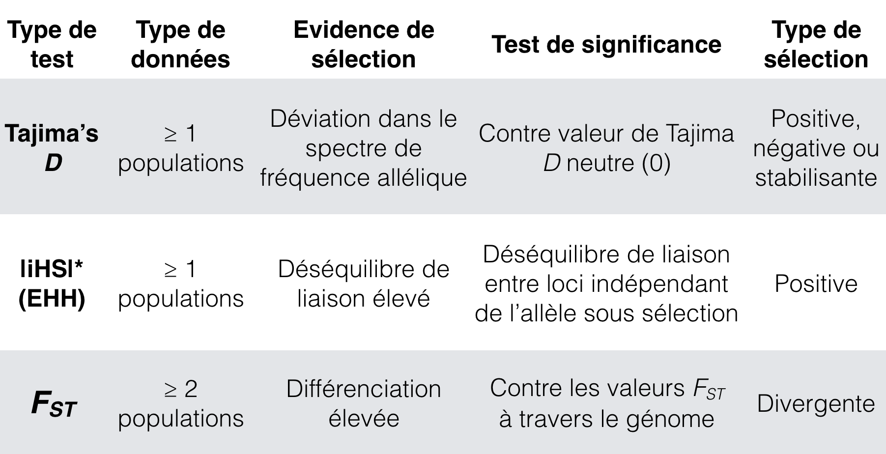
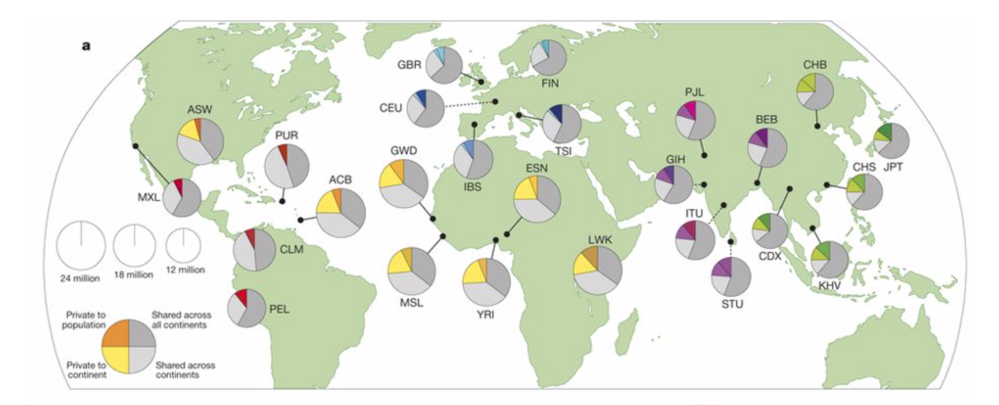
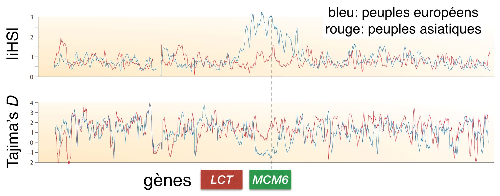

### TP Génétique évolutive 6


# Analyses de sélection dans les populations humaines


### Buts de ces travaux pratiques

- Comprendre les signatures principales de sélection au sein d'une espèce
- Réflection sur la distinction entre les processus neutres et sélectifs

### Concepts importants

Référez-vous aux slides du cours "Génétique évolutive" si besoin.

- Techniques de séquençage, SNP
- Principal component analyses (PCA), F<sub>ST</sub>
- Tajima's *D*
- Peuplement de la terre par l'homme. Pour les intéressés: [Nielsen et al. 2017](https://www.nature.com/articles/nature21347)

### Les tests principaux de sélection

Uniquement des tests applicables au sein d'une espèce sont notés ici.



### Les données: "The 1000 Genomes Project"  
- La publication principale est apparue dans Nature vol 526, pages 68–74, 2015: [https://www.nature.com/articles/nature15393](https://www.nature.com/articles/nature15393)
- 2504 individus de 26 populations à travers le monde
- 84.7 millions SNP identifiés



### Les données simplifiées pour ces TP

- Facultatif: Explorez les données SNP mises à disposition en utilisant un navigateur FTP. L'adresse suivant doit être utiliser: ftp://ftp.1000genomes.ebi.ac.uk/vol1/ftp/release/20130502 (le login doit être "anonymous" ou en tant que guest)  


  

- Pour ces TPs, nous avons généré un sous-échantillonnage des SNPs (1 sur 2000) pour ne pas alourdir trop les analyses. Le fichier complet serait d'environ 1 TB. Le fichier préparé pour les TPs s'appelle `Human1000G.2000xSubsampled.MAF0.05.recode.vcf` (format VCF). Ce fichier est aussi filtré pour une fréquence allélique mineure (MAF) >0.05. Donc, les allèles rares n'y figurent plus!

- Cliquez sur le fichier correspondant et puis sélectionnez "Raw" ou "Download". Enregistrez le fichier au bon endroit sur votre ordinateur.

- Attention: Assurez vous que votre ordinateur n'a pas modifié l'extension des fichiers (e.g. `.vcf` en `.vcf.txt`).


## La distribution des valeurs F<sub>ST</sub> à travers le génome humain

Jusque-là, nous nous sommes uniquement intéressés au F<sub>ST</sub> moyen à travers le génome. Cette valeur moyenne reflète très précisément la différenciation génétique entre population.

Ici, nous allons étudier la distribution de ces valeurs à travers le génome. Une valeur F<sub>ST</sub> très élevée à un locus particulier indique une forte différenciation entre populations. Un tel locus pourrait alors coder pour un phénotype impliqué dans l'adaptation locale. Le raisonnement est que la sélection favoriserait localement un certain allèle. Les autres populations soit subiraient aucune sélection sur cet allèle ou favoriseraient même l'allèle alternatif. Ces processus génèrent des différenciation en fréquences alléliques entre populations.

### Reprise du code du TP4 pour charger un fichier VCF

Nous reprenons d'abord la fin des exercises de la dernière semaine. Chargez le fichier VCF `Human1000G.2000xSubsampled.MAF0.05.recode.vcf` du génome intégral. Puis, assignez les individus aux populations.

(Revenez aux TP4 si le code ci-dessous ne paraît pas assez clair.)

```
# à ajuster si besoin!
# setwd("/home/ge-daniel/some_folder")

# obtenir les fichiers
system("wget https://raw.githubusercontent.com/crolllab/teaching/master/TP_Génétique_évolutive/TP_6_Selection_pop_humaines/Human1000G.2000xSubsampled.MAF0.05.recode.vcf")
system("wget https://raw.githubusercontent.com/crolllab/teaching/master/TP_Génétique_évolutive/TP_6_Selection_pop_humaines/Human1000G.MCM6.vcf")
system("wget https://raw.githubusercontent.com/crolllab/teaching/master/TP_Génétique_évolutive/TP_6_Selection_pop_humaines/Human1000G.info.txt")

# chargez les packages
library(vcfR)
library(adegenet)
library(ggplot2)
library(hierfstat)
library(gplots)
library(RColorBrewer)
library(pegas)
library(reshape2)


# lire le fichier VCF & conversion en format genind
vcf <- read.vcfR("Human1000G.2000xSubsampled.MAF0.05.recode.vcf")
allchr.snps.genind <- vcfR2genind(vcf)
allchr.snps <- vcfR2genlight(vcf)

# en utilisant ces pièces d'information, créer un dataframe
allchr.df <- data.frame(position = allchr.snps@position, chromosome = allchr.snps@chromosome, SNPid = allchr.snps@loc.names)
# générer l'ordre correct des chromosomes
allchr.df$chromosome <- factor(allchr.df$chromosome, levels = c(1:22, "X"))

# lire le fichier résumant l'information sur les populations
info.df <- read.table("Human1000G.info.txt", header=T, sep="\t")

# voir les catégories
head(info.df)

# assignez les individus aux populations ("Population.name")
pop(allchr.snps) <- info.df$Population.name[match(indNames(allchr.snps.genind), info.df$Sample.name)]
pop(allchr.snps.genind) <- info.df$Population.name[match(indNames(allchr.snps.genind), info.df$Sample.name)]
```

### Calculs des valeurs F<sub>ST</sub> et autres statistiques

```
# Calculs d'un grand nombre de statistiques par populations et loci (y inclut les Fst). Etape lente (1-3').
pop.stats <- basic.stats(allchr.snps.genind)

### Inspectez les composantes de pop.stats (voir TP 5)

# Les fréquences alléliques à un locus spécifique (e.g. le SNP rs6537484)
pop.stats$pop.freq$rs6537484
```

### Exploration de la diversité génétique à travers les populations humaines

```
# création d'un data.frame résumant Fis et Hs, puis l'information sur les populations
pop.stats.df <- data.frame(Fis = colMeans(pop.stats$Fis, na.rm = T), Hs = colMeans(pop.stats$Hs, na.rm = T), Population.name = names(colMeans(pop.stats$Fis, na.rm = T)))
head(pop.stats.df)

# création d'une colonne résumant les régions
pop.stats.df$Superpopulation.name <- info.df$Superpopulation.name[match(pop.stats.df$Population.name, info.df$Population.name)]

# inspection du contenu
head(pop.stats.df)

# visualisation du Fis à travers les populations
ggplot(pop.stats.df, aes(y = Fis, x = reorder(Population.name, Fis), fill = Superpopulation.name)) +
  geom_bar(stat = "identity") + labs(x = "Populations") +
  theme(axis.text.x = element_text(angle = 45, hjust = 1))

ggsave("Fis_populations.pdf", width = 8, height = 7)
```

Q1: Quelles sont les causes probables d'un F<sub>IS</sub> élevés chez certaines populations humaines?

Q2: Est-ce que le niveau de consanguinité d'une population a un impact sur l'efficacité de la sélection de favoriser un allèle avantageux? Expliquez pourquoi oui ou non.

Q3: Visualisez la distribution des valeurs F<sub>ST</sub> à travers tous les loci à l'aide d'un histogramme. Rajoutez une ligne verticale pour la valeur F<sub>ST</sub> moyenne.

Q4 (optionnelle): Quel type de distribution statistique observez-vous probablement? Est-ce que toute déviation de valeur F<sub>ST</sub> à un locus par rapport au F<sub>ST</sub> moyen indiquerait un locus sous sélection? Quelle approche plus robuste pourrait-on imaginer pour identifier les loci réellement sous sélection?

### Création d'un data.frame comprenant les positions chromosomales et statistiques par locus (Hs, Fst, etc.)

```
stats.df <- pop.stats$perloc
stats.df$SNPid <- row.names(stats.df)
# allchr.df a été créée précédemment
stats.allchr.df <- merge(allchr.df, stats.df)

head(stats.allchr.df)
```

### Visualisation des valeurs F<sub>ST</sub> le long des chromosomes

```
ggplot(stats.allchr.df[stats.allchr.df$chromosome %in% 1:5,], aes(x=position/1000000, y=Fst)) +
  geom_point() + geom_smooth(size = 1, span = 0.05) +
  coord_cartesian(ylim=c(0, 0.6)) +
  labs(x = "Position in Mb", y = "FST per locus") +
  facet_grid(chromosome ~ .)
ggsave("Fst.per-locus.pdf", width = 12, height = 8)
```
Visualisez la distribution des valeurs F<sub>ST</sub> le long des chromosomes 1-5.

Q5 (optionnelle): Quelle est la raison probables des grandes régions chromosomales sans SNP?

Q6: Identifiez à l'oeil une ou plusieurs régions potentiellement sous sélection divergente (F<sub>ST</sub> élevé). Expliquez brièvement votre choix.


### Visualisation des fréquences alléliques à des loci avec un F<sub>ST</sub> extrême

Nous allons investiguer la distribution des fréquences alléliques par population. Vu que nous nous intéressons à des loci avec un F<sub>ST</sub> extrême, nous attendons à des fortes différences au niveau des fréquences alléliques.

```
# visualisez les SNPs avec les Fst les plus extrêmes (tri du data.frame)
head(stats.allchr.df[order(-stats.allchr.df$Fst),])

# fréquences alléliques à travers les populations d'un SNP en particulier: e.g. rs10270859
locus <- "rs10270859"

SNP.freq.table <- as.data.frame(pop.stats$pop.freq[locus])
names(SNP.freq.table) <- c("allele", "population", "frequency")

SNP.freq.recast <- dcast(SNP.freq.table, population ~ allele)
names(SNP.freq.recast)[2:3] <- c("REF", "ALT")

# rajoutez l'information sur les régions
SNP.freq.recast$region <- info.df$Superpopulation.name[match(SNP.freq.recast$population, info.df$Population.name)]

# visualisation des fréquences
ggplot(SNP.freq.recast, aes(x = reorder(population, REF), y = REF, fill = region)) +
  geom_bar(stat = "identity") +
  labs(x = "Population", y = "Reference allele frequency") +
  ggtitle(paste(locus)) +
  theme(axis.text = element_text(colour = "black"), axis.text.x = element_text(angle = 45, hjust = 1))

ggsave(paste0("Allele_freq-",locus,".pdf"), width = 7, height = 4.5)
```

Q7: Décrivez le pattern des fréquences à travers les populations. Essayez d'expliquer le pattern par un processus neutre. Alternativement, quel scénario de sélection aurait pu générer ce pattern?

Q8 (optionnelle): Explorez la région comprenant le SNP rs10270859 à l'aide du site [Ensembl](http://www.ensembl.org/Homo_sapiens/Info/Index). Quel est l'allèle ancestral (partagé avec d'autres primates)? Dans quelle région au monde est l'allèle ancestral le plus fréquent? Est-ce que ceci correspond à votre prédiction?

Q9 (optionnelle): Dans quel gène se trouve le SNP rs10270859. Trouvez l'information à l'aide d'[Ensembl](http://www.ensembl.org/Homo_sapiens/Info/Index). Quelle est la fonction prédite du gène qui se trouve au même locus?

Q10 (optionnelle): Choisissez trois autres SNP parmi les 10 avec un F<sub>ST</sub> extrême et visualisez les fréquences alléliques. Décrivez le pattern général observé à travers les loci.

Q11 (optionnelle): Avec vos connaissances sur la distribution des fréquences alléliques aux SNP avec un F<sub>ST</sub> extrême, postulez des limites de l'analyse de sélection basée sur les F<sub>ST</sub> pour cette espèce.


## L'analyse du Tajima *D* au locus codant pour la lactase

Revue traitant le sujet de la sélection récente chez l'homme: https://www.nature.com/articles/nrg2187

Référez-vous au cours de génétique évolutive pour plus d'information sur l'histoire du locus codant pour la lactase.




Le jeu de SNP utilisé jusque là (`Human1000G.2000xSubsampled.MAF0.05.recode.vcf`) ne comprenait pas les loci avec allèles rares (fréquence d'allèle mineur < 5%). Vu que l'analyse du Tajima D est basée sur les fréquences alléliques, ce jeu de SNP est inapproprié alors.

Nous allons alors utilisé le jeu de données suivant:
- Fichier VCF `Human1000G.MCM6.vcf` comprenant uniquement la région suivante: chromosome 2 et positions 135'839'660-135'876'378 bp codant pour le gène *MCM6*.

Visualisation sur [Ensembl](http://www.ensembl.org/Homo_sapiens/Gene/Summary?db=core;g=ENSG00000076003;r=2:135839626-135876426).

La région du gène *MCM6* comprend les mutations qui régulent l'expression du gène *LCT* (lactase). Pour identifier une signature de sélection sur l'expression du gène LCT, il faut alors bien analyser la région du gène *MCM6* au lieu du *LCT* en soi.

Q12 (optionnelle): Quelle est la distance physique entre les exons les plus proche de *LCT* et *MCM6*?

Q13: Quelles signatures de sélection correspondent à un Tajima's D positif et négatif?

Q14: Expliquez vos attentes en ce qui concerne les populations qui auraient subi une forte sélection pour la capacité de digérer la lactose. Attentes pour l'Afrique et l'Inde?

### Préparation des données de la région *MCM6*
```
# lire le fichier MCM6 (le locus de la lactase)
vcf <- read.vcfR("Human1000G.MCM6.vcf")
MCM6.DNAbin <- vcfR2DNAbin(vcf)

# lire le fichier résumant l'information sur les populations
info.df <- read.table("Human1000G.info.txt", header=T, sep="\t")

# voir les catégories
head(info.df)

# création d'un data.frame avec les colonnes populations, région et Tajima's D
taj.df <- data.frame(pop=unique(info.df$Population.name), tajima=NA)
taj.df$region <- info.df$Superpopulation.name[match(taj.df$pop, info.df$Population.name)]
```

### Visualisation du spectre de fréquences alléliques

```
# sélection de la population à étudier (essayez d'autres selon votre choix)
pop <- "CEPH"

selected.samples <- info.df$Sample.name[info.df$Population.name == pop]
MCM6.subset <- MCM6.DNAbin[grepl(paste(selected.samples,collapse = "|"), labels(MCM6.DNAbin)),]

# identifiez les positions des SNP effectivement variables au sein de la population
seg.sites(MCM6.subset)

# visualisation de l'alignement SNP variables et constants au sein d'une population donnée
pdf("MCM6_alignment_view.pdf", width=10, height=8)
image.DNAbin(MCM6.subset, show.labels = F, xlab = "Number of SNPs in MCM6", ylab = "Individuals in population")
dev.off()

# analyse de la fréquence allélique à chaque position
freq.spectrum <- site.spectrum(MCM6.subset)
# nombre d'individus par population
n.ind <- nrow(MCM6.subset)

# visualisation du spectre de fréquences alléliques
qplot(freq.spectrum[freq.spectrum > 0] / n.ind, binwidth = 0.05) +
  labs(x = "Allele frequency", y = "Number of SNPs") +
  ggtitle(paste(pop))
ggsave(paste0("MCM6_frequency_spectrum_",pop,".pdf"), width=4, height=3)
```


### Visualisation du Tajima *D* par population: région du *MCM6*

```
# le principe de la fonction tajima.test
tajima.test(MCM6.subset)

# voilà un loop qui calcule le Tajima D par population
for (pop in unique(info.df$Population.name)) {
  selected.samples <- info.df$Sample.name[info.df$Population.name == pop]
  MCM6.subset <- MCM6.DNAbin[grepl(paste(selected.samples,collapse = "|"), labels(MCM6.DNAbin)),]
  if (dim(MCM6.subset)[1] > 0) {
    taj.df$tajima[taj.df$pop == pop] <- tajima.test(MCM6.subset)$D
    }
}

taj.df <- taj.df[!is.na(taj.df$tajima),]

ggplot(taj.df, aes(x=reorder(pop, tajima), y=tajima, fill=region)) +
  geom_bar(stat = "identity") +
  labs(x="Populations", y="Tajima's D", legend = "NA") +
  theme(axis.text.x = element_text(angle = 60, hjust = 1), axis.text = element_text(color = "black"))

ggsave("TajimaD.lactase.pdf", width = 6, height = 4)
```

Q15 (optionnelle): Visualisez l'alignement des positions SNP au sein du gène *MCM6*. Est-ce que vous êtes surpris par la proportion des SNP qui sont effectivement variables par population?

Q16 (optionnelle): Sélectionnez trois populations parmi lesquelles vous soupçonnez de trouver un contraste au niveau du Tajima *D*. Visualisez les spectres de fréquences alléliques et discutez ce que vous observez. Quel type de sélection (ou neutralité) vous prédisez?

Q17: Faites l'analyses des Tajima *D*. Discutez l'évidence pour la sélection de digérer la lactose à travers le monde. Est-ce que les régions avec un fort signal de sélection correspondent avec l'emergence de l'agriculture laitière?
